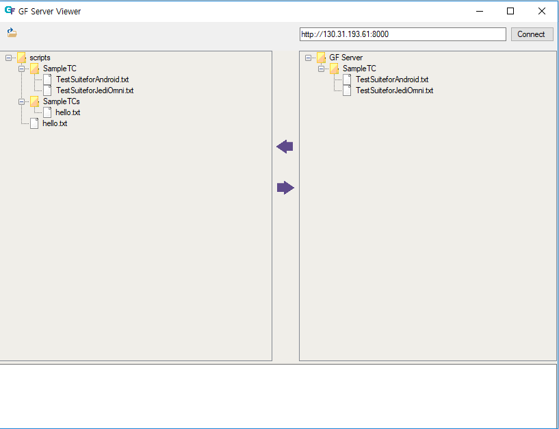
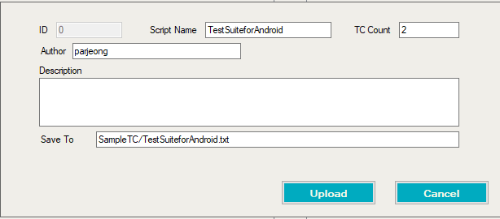
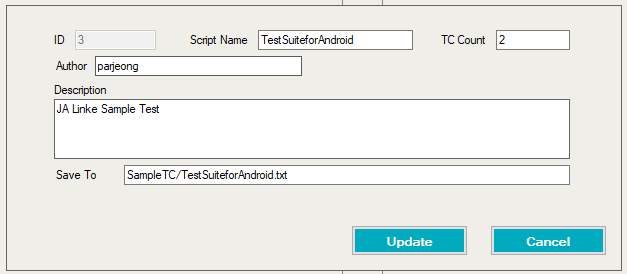

# Script Repository Connector

NOTE : if you have problem with connect to the server and you use dual network of Wireless and Wired, Run follwoing command in Windows commandline with administrator privilege.

```powershell
route -p add 130.31.193.0 mask 255.255.255.0 130.31.0.1
```

## Overview


- Local Script Folder : Left pane displays GF scripts in local script folder. You can change local script root with folder selection button.

- Server Viewer : Right pane displays GF scripts in the Server. You can change server with new address and connect button.


## Upload Script
If you click the  after select one script, following upload pane will be displayed. Or you can double-click on the script to upload.



You can change Script Name, TC Count(not recommended), Author, Description and Save To.

Your script will be saved with metadata you entered in server with "Save To" path.

NOTE : If there is same file in "Save To" path in the server, it will be updated not create new record.


## Update Script Info
If you click on script in Server Viewer, following update pane will be displayed.



You can modify the metadata of script.


## Download Script(s)
If you click click the  after select one script or script folders in server pane, selected script(s) will be downloaded to your local script folder with hierachy of the server.
