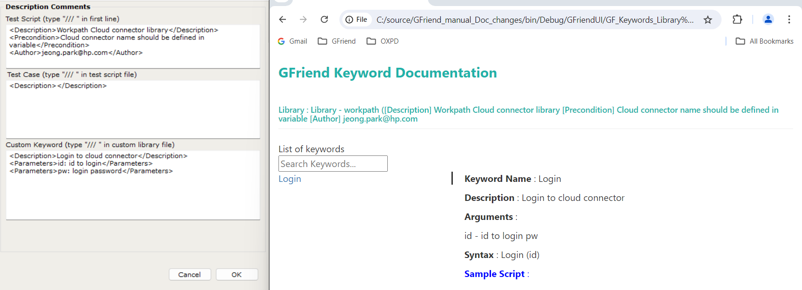
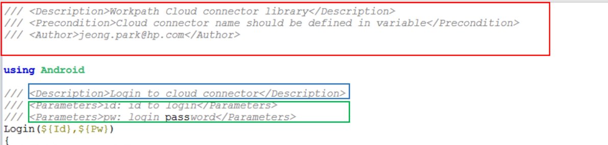

# Custom library documentation guide

This section describes documentation guide for custom library, but it also can be applied for test script and test cases.

## Prepare documentation template
Goto Tool-Options in GFriend menu, you can set template that will be used for describing Test Script or Custom library file (Test Script section), Test case (Test Case section) and Custom Keyword(Custom Keyword section.) GFriend suggest to use descriptions in format of XML so that you can use these values laster.

## Test Script / Custom library file descriptions

If you type "/// " (Three slashes and space) in the first line of file, template from Test Script section will be automatically inserted. Note that scrip/custom library file description MUST be placed in the first line of file.

## Custom Keyword / Test Case

If you type "/// " in custom library file (Note that, to insert correctly you need to save file first with .gflib extension) template from Custom Keyword section will be inserted. You can insert this descriptions above every custom keyword name.
(This behavior is almost same as Test cases in normal test script file.)

## Converting user inserted documentation to Keyword manual

Well-documented custom library can be converted to keyword manual.

### Custom library description

All information that you wrote in custom library description will be displayed in description section in keyword manual. (see Red box)

### Keyword description

Inner text of XML node <Description> will be placed in keyword description section (see blue box) and <Parameters> will be placed in argument section (see green box)

## Generating custom keyword manual

You need to do nothing but by saving custom library file to generate keyword manual. Also GFriend will search in local script repository and generate keyword manual for all custom library in the local script repository.
You can check this keyword manuals in Help-Keyword List in GFriend menubar.
