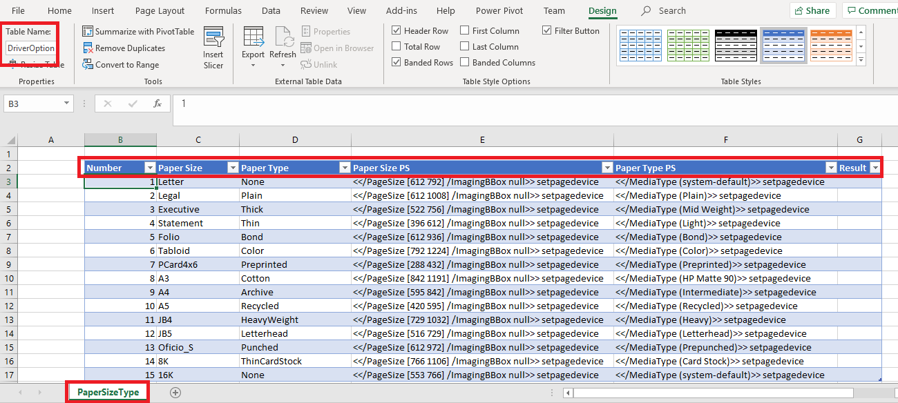
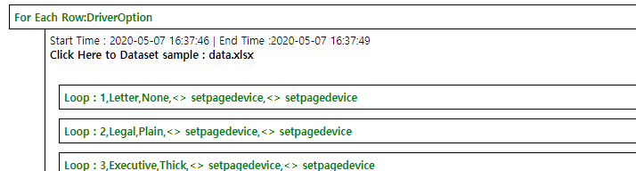

# GF Script Guide

## Variables
    
GFriend treats text with format ${variable_name} as variable. Tester can also use other variable name with [A-Za-z0-9_-].
See Also : [Examples](../Samples/Variables/README.md)

1. Static(Unchanged) Variables

    Definition of variable should keep following syntax:
    ```Javascript
    ${Variable_Name}=Variable_Value
    ```

    Variable should be defined at very first lines of test script file or separate variable file(.gfvar). If tester want to use variable file(s) in their test script, using xxx.gfvar can be used. Like using custom library, variable file also can be specified with file name only (if variable file is existed in same folder of script), relative path(using ../vars/common.gfvar) or absolute path(using C:\GFScripts\vars\common.gfvar)

    ***NOTE :*** Variable file (.gfvar) does not support comment with same line of variable declaration because some variable value can have form with comment which start with double slash(//) such as xpath value like //*[@id='login']. To add comment on your variables in variable file, please insert with new line.
    
    GFriend will replace variable names in the script to variable values **BEFORE** execution script. That means while executing, variable is treated as text.

    Note: It just like #define in C language.

1. Dynamic variables

    This variables do not need declaration. Like example below, tester set variable value with Get keywords and it also contains declaration.

    ```Javascript
    // Following Keyword save text value of object with resource id 'textboxid1' to ${Buffer}
    Android.Get Text(textboxid1, ${Buffer})
    
    // Then you can use stored value in other keyword
    Android.Set Text(inputboxid1, ${Buffer})
    ```

    Keywords such as Android.Get Text, Web.Get Text and JediOmni.Get Text can use pre-defined ${Buffer} as variable to save value.

1. Execution variables

    Execution variables can be given when run GFriend script with command line. This has highest priority when replacing variable to its value.

    For example, if you wrote script as below:

    ```javascript
    ${UserName}=someUser
    ${UserPassword}=somePassword
    using Solution.gflib

    Login Test
    {
        Solution.login(${UserName},${UserPassword})
    }
    ```
    
    In normal case, script will try to login with someUser and somePassword but if you run with execution variable as below,

    ```
    GF_Runner.exe -t LoginTest.txt -e ${UserName}:otherUser -e ${UserPassword}:otherPassword
    ```
    script will try to login with otherUser and otherPassword.
    
    (You can give variable file name to be used as execution variable with -v option)

    Also, you can use execution variable within Using, Resource, Dataset statement so you can dynamically use library, variable, resource and dataset files.

    ```javascript
    [HPAdvance.txt]
    using HPAdvance_${UISize}.gflib As HPAdvance_Lib
    
    Login Test
    {
        HPAdvance_Lib.Login(user001, password)
    }


    [HPAdvance_7inch.gflib]
    using JediOmni
    Login(${id},${pw})
    {
        JediOmni.Touch Id(LoginButton_Small)
    }


    [HPAdvance_10inch.gflib]
    using JediOmni
    Login(${id},${pw})
    {
        JediOmni.Touch Id(LoginButton_Large)
    }
    ```
    Like examples above, you can select library file to use in execution time.

    ***NOTE: Only execution variable will be supported in Using, Resource and Dataset statements***

1. <a name="a_sys_var"></a>System defined variables

    GFriend also provide pre-defined variables in system level. This type of variables also can be provided in library level.

    Followings are system provided variables:

    ```
    // Device variables
    ${DUT_Address} : Default device's address
    ${DUT_AdminID} : Default device's admin Id
    ${DUT_AdminPW} : Default device's admin Pw
    ${DUT_ID} : Default device's Identifier
    ${DUT_TYPE} : Default device's Device Type

    // Control variables
    ${R} : Current repeat count in Repeat block.

    // Environment variables
    ${SCRIPT_FOLDER} : Folder of script file is located
    ${OUTPUT_FOLDER} : Folder of output files are saved
    ${KEYWORD_OUTPUT} : Last executed keyword's output
    ${KEYWORD_RESULT} : Last executed keyword's result (Pass, Fail or Error)

    // Other variables
    ${EMPTY} : Empty String
    ${CARRIAGE_RETURN} : Carriage Return (\r)
    ${LINE_FEED} : Line Feed (\n)
    ```

    Also you can refer their value with system defined variable : ${DUT_[Capability Key with Upper case]}.


## Keywords

If tester want to use keywords form some library, declare library name with using statement.

```javascript
ex. using Android
```
Keyword should be start with Library name and dot such as Android.Touch Text(Copy)

Tester can ommit library name for using Built-In library.


## Using statement

Tester can declare new library name with 'As' and also target device with 'With' statement. For remote run, 'At' shall be used at the end of the using statement. Order of 'As', 'With' and 'At' shall be followed in using statement. (Using JediOmni As OmniUI With Ruby At Remote01)

```javascript
// If tester declare using as below, tester should use CellPhone as library name in their script
using Android as CellPhone

testcase
{
    CellPhone.Touch Text (Contact) // This keyword calls Android.Touch Text
}
```

By using 'As' statement, tester can control multiple instance for some kind of library (ex. Web)

```javascript
using Web As Google
using Web As HP

Web Test Case
{
    // Following keywords will open chrome browser with google page and firefox browser with hp home page.
    Google.Open With Chrome (www.google.com)
    HP.Open With Firefox (www.hp.com)
}
```

Tester can specify target device as example below:

```javascript
using Android With Tablet
using JediOmni With Ruby

Mobile Print Test
{
    ...
    Android.Touch Text (Print) // Control Android device which its device id is 'Tablet'
    JediOmni.Wait For Text (Printing, 10) // Control Ruby which its device id is 'Ruby'
}
```
'With' statement use device ID to distinguish devices. The device ID is defined Device List menu in the UI. If tester will not use 'WIth' statement, default device is used for test.

Also tester can use both 'With' and 'As' in same using statement. By this way, tester can control multiple target with same library as example below.
```javascript
using Android As Mobile With Note9
using Android As JALink With Ruby
using JediOmni With Ruby

Mobile combined Test
{
    ...
    Mobile.Touch Text (Print All)
    JediOmni.Touch Text (Mobile Print Solution)
    JALink.Input Text (Login, test@test.com)
    ...
}
```

'At' Statement use Remote executor id which is managed as device. If 'At' statement is used, GFriend will initialize remote executor when test execution start with given libraries. (See more information for remote execution, Click [here](../GFRemote/README.md))

## Resource Statement

Tester can specify resource files (MS Word document, PDF Document, etc.) which can be used in test script by Resource statement. Format of resource statement is as below:

```javascript
Resource [resource_file_path] As [resource_file_name]
(ex. Resource C:\UPD_Test\TestFiles\Word_10_Pages.docx As Word10)
```

Resource file path can be absolute path (start with C:\ or D:\\) as well as relative path. If tester define resource path with relative path just like 'testfiles\Word_10_Pages.docx', GFriend will find files under same folder which test script is located.

In test script, tester can use resource file name as below example:

```javascript
Resource C:\UPD_Test\TestFiles\Word_10_Pages.docx As Word10

Word File Print Test
{
    Hallasan.Open File For Print(Word10, ${DriverName})
}
```


## Test cases

Test script (Test suite) can have one or multiple test cases.

Test case should started with test case name and then test case body should be followed surrounded with { and }.

Test case body can include Repeat block as well as keywords.

```javascript
Testcase01 // Testcase name
{
    // Testcase body
}
```

## Repeat

Tester can declare Repeat block with run with defined iteration. See Also : [Examples](../Samples/FlowControl/README.md#repeat)

Repeat declaration should keep following syntax:

```javascript
Repeat:5 // Repeat following block five times
{
    // Keywords to repeat
}
```

Tester can use pre-defined variable ${R} which will replace to repeat count at runtime.

Also you can give time based interval by giving time frame. Time frame can be h(hours), m(minutes) and s(seconds)

```javascript
Repeat:5s // Repeat with 5 seconds
Repeat:10m // Repeat with 10 minutes
Repeat:72h // Repeat with 72 hours
```

## While

Tester can repeat block of keywords with conditions by using While command.

While keyword block will run if given condition is passed (or failed) within given number of retry (default 50 loops) See Also : [Examples](../Samples/FlowControl/README.md#while)

While declaration should keep following syntax:

```javascript
While:[Condition](:[Maxium_number_of_loop])
{
    // Keywords to repeat
}
```

Condition can be any keyword. If keyword in condition is passed, keywords in the block will be executed.

If tester want to execute keyword block when condition is failed, use prefix '!' at the start of condition.

See following example of While command:

```javascript
// Following case will repeat clicking text of 'Next' until when 'Next' is shown at the screen.
// If 'Next' is still shown until 10th repetition, that While block will ends with Fail.
While:Android.Check Screen Contains Full Text (Next):10
{
    Android.Touch Text(Next)
    Sleep(5)
}

// Following case will also have same result of above case. (See how to use '!' prefix)
While:!Android.Check Screen Not Contains Full Text (Next):10
{
    Android.Touch Text(Next)
    Sleep(5)
}

// If tester omit max repetition as below, GFriend will set default maximum number of loop to 50.
While:Web.Wait For Text(Continue)
{
    Web.Refresh
    Sleep(5)
}
```


## If

Tester can define keywords block to execute based on result of the keyword by using If command.

Tester can declare 3 types of keyword block which is If, Fail and Error.

Based on condition execution result, one of each block will be executed.
See Also : [Examples](../Samples/FlowControl/README.md#if)


If declaration should keep following syntax:

```javascript
If: [Condition]
{
    // Keyword to run if condition is passed.
}
Fail:
{
    // Keyword to run if condition is failed.
}
Error:
{
    // Keyword to run if condition is error.
}
```

Each block also can not contains any keyword to run, and Fail and Error block can be omitted.

See following example:

```javascript
// If there is warning pop-up at Android, close pop-up by clicking OK button.
If: Android.Check Screen Contains Full Text (Warning)
{
    Android.Touch Text (OK)
}
Error:
{
    // Do Nothing
}
Fail:
{
    Android.Capture Screen Shot(PopupCheckError)
}
```

## For

It is a control flow statement and executes the code written in the body of the loop for each element of the array or collection.
See Also : [Examples](../Samples/FlowControl/README.md#for)

```javascript
for: [list]
{
    // Keyword to run if condition is passed.
}
```

See following example

```javascript
${DocTypes}=Pdf, Doc, xls, xlsx, CSV

Test_ForLoop
{
        for:${DocTypes}
        {
            Pass (${ITEM}) //prints each item of ${DocTypes} in the report file
        }
} 
```

## Dataset and For Each Row

Note: To use Dataset excel file in GFriend, you must install Excel application on your environment.

GFriend provide data driven test with DataSet and For Each Row. Excel file can be used for dataset and Excel file must have table for DataSet.

Tester can specify dataset files by DataSet statement just like Resource statement. Format of DataSet statement is as below:

```javascript
DataSet [dataset_file_path] As [dataset file name]
(ex. DataSet PrinterDriverData.xls As DriverData)
```

DataSet file path can be absolute path (start with C:\ or D:\\) as well as relative path just like resource path. This dataset file will be copied to the output folder when test execution.



Like above example, GFriend need data table (with column headers) in Excel for dataset. Also sheet name and column name are used in the script to access the dataset.

Since DataSet is defined, Tester can use data set in the script by using For Each Row. It iterates each row in data set table. Usage of For Each Row is as below:

```javascript
For Each Row:[DataSet].[SheetName].[TableName]
{
    // can use variable name with column name. To meet variable format requirements, spaces in the column name are removed. (ex. Paper Type -> PaperType)
}

Example)

DataSet PrinterDriverData.xls As DriverData
Sample TC
{
    For Each Row:DriverData.PaperSizeType.DriverOption
    {
        ...
        LP.Set Option(PageSize,${PaperSize})
        LP.Set Option(MediaType,${PaperType})
        ...
    }
}
```

Tester also can write data (e.g. test result) in the dataset by using Builtin keyword Write To Data Set. This keyword must be called within For Each Row loop.

```javascript
Example)
Write To Data Set (Result, Pass)
```

After test execution, tester can see link of dataset file in report as below.



See more examples [here](../Samples/DataDrivenTest/README.md).

## Remote Run
If script has using statement with 'At', tester can use Remote run in your script. (See more information for remote execution, Click [here](../GFRemote/README.md))


Remote Run declaration should keep following syntax:

```javascript
Remote Run:[RemoteExecutorName]
{
    // Keywords to run in remote executor.
}
```

Remote Run block is executed in asynchronous. So if keywords in Remote Run block do not finished, next line of Remote Run will be started. Use Wait For Remote Complete keyword to wait remote run block.

## Escape Characters

   If arguments of keyword has special characters[ ( ) , ] tester must give argument with \ such as \\(  \\)  \\,

[ex. Touch Text(2 sided, Book) --> Touch Text(2 sided\\, Book)]

1.Passing escape characters in variables :

```javascript
${variable}=Please\, retry sending or cancel. Incident code: SN412

PrintMessage
{
    Pass(${variable})
}
```
Output :  Please, retry sending or cancel. Incident code: (SN412)

2.Passing escape characters in keyword parameters
 
```javascript
PrintMessage
{
    Pass(Please\, retry sending or cancel. Incident code: \(SN412\))
}
```

Output :  Please, retry sending or cancel. Incident code: (SN412)

3.Passing escape characters in gfriend custom library methods

```javascript
//Common.gflib
PrintString(${stringvalue})
{
    pass(${stringvalue})
}

//In script file(.txt)
PrintMessage
{
    Common.PrintString(Please\, retry sending or cancel. Incident code: SN412)
}
```

Output :  Please, retry sending or cancel. Incident code: SN412

## Comment

Test script consider as comment along with //

Tester can also add testcases' metadata with ///. If tester types /// in the script editor, metadata template will be automatically inserted.

## Operator

Tester can use always pass operator(@) with keyword or blocks (repeat, if and while.) If tester use this operator (ex. @Android.Touch Text(some text)), this will always pass even if actual result is error or fail. See Also [examples](../Samples/FlowControl/README.md) of operator usage within a flow control.

# User Custom Library

Tester can create their own library with GFriend script language. See Also [Documentaion Guide](Custom/README.md).

## Creating new file with extension .gflib

GFriend will handle gflib files as library. You can specify custom library file with file name (if custom library file is existed in same folder of script), relative path(using ../libs/common.gflib) or absolute path(using C:\GFScript\lilbs\common.gflib)

Custom library file is just same as script file. Test cases in script file is matched as keyword in custom library file.

Following is simple example of custom library file.


```javascript
using JediOmni
using Android

Launch One Drive and Login
{
    JediOmni.Touch Text (HP for One Drive Professional)
    Android.Get Webview
    Android.Wait For Web Object (//*[@id='login'],30)
    Android.Set Text Web Object (//*[@id='login'], testhp@gmail.com)
    Android.Set Text Web Object (//*[@id='password'], testpassword@1111)
    Android.Touch Web Text (Login)
}
```
After save this file with file name "OneDrive.gflib", tester can use "Launch One Drive and Login" keyword at their script.


User also can define argument(s) of custom library. Declaring Keyword with argument(s) can be done with following syntax:

Custom Keyword Name (${argument1} , ${argument2})

See below example for using custom keyword

```javascript
using Web

Open Web Page and Click Search (${webpage})
{
    Web.Open With Chrome (${webpage})
    Web.Click Text (Search)
}
```

## Use custom library

GFriend import library as a custom library if using statement ends with ".gflib". (ex. using OneDrive.gflib)

Following is simple example of using custom library


```javascript
using Onedrive.gflib
using Android


One Drive Test
{
    Onedrive.Launch One Drive and Login
    Android.Touch Text (Sample Folder)
    Android.Touch Text (SampleFile.ppt)
    Android.Touch Text (Print)
    ...
}
```


# GFriend Command Line Arguments

Tester can run GFriend test in command line by using GF_Runner.exe

Followings are command line arguments

```
-t | -testsuite : Test Suite to Run
-c | -testcase : Test case to run (surrounded with double quote ("), comma separated)
-i | -ipaddress : IP address or device identifier of DUT
-a | -adminId : admin ID of DUT
-p | -adminPw : admin Password of DUT
-o | -output : output folder
-f | -outputToFix : for fixing broken output.xml
-s | -testRunSpec : Test Run spec xml file
-k | -keywordDOc : Generate keyword documentations
-v | -variableFile : Path of execution variable file
-e variableName:variableValue : specify execution variables. (Can be used multiple times)
-d | -device : multi-device configuration. See [Multi-Device CLI Command Implementation](#multi-device-cli-command-implementation) for details
```

## Test Run Spec

Tester can also run GFriend Test with xml file (TestRunSpec.) 

See following example with explanation:

```xml
<!-- All Test run spec shall be declare in TestRuns tag-->
<TestRuns Repeat="2"> <!-- (optional) if Repeat attribute is provided, GFriend will repeat all test suites with repeat count. Repeat attribute must surrounded with quote -->

<!-- All information to run singe test suite shall be provided within TestSuite tag -->
<TestSuite Repeat="3"> <!-- (optional) if Repeat attribute is provided, GFriend will repeat test suites with repeat count. Repeat attribute must surrounded with quote -->
    <TestSuitePath>C:\Git\GFriend\bin\Debug\GFriendUI\scripts\a.txt</TestSuitePath> <!-- TestSuitePath must be provided -->
    <DefaultDevice>Ruby</DefaultDevice> <!-- (optional) if default device need to be provided, use DefaultDevice tag with device id -->
    
    <!-- All DUT(s) which is(are) needed to run test shall be provided with DeviceUnderTest tag -->
    <DeviceUnderTest>
        <DeviceId>Ruby</DeviceId> <!-- If test script uses using xxx With yyy, Device Id must be provided -->
        <Description>Ruby dut</Description> <!-- (optional) -->
        <DeviceAddress>130.31.10.60</DeviceAddress> <!-- Device IP address or ID (with adb devices) -->
        <LanDebugAddress>1.2.3.4</LanDebugAddress> <!-- (optional) -->
        <Port>22</Port> <!-- (optional) -->
        <AdminId><ADMIN_ID></AdminId> <!-- (optional) -->
        <AdminPassword><ADMIN_PASSWORD></AdminPassword> <!-- (optional) if test script use JediOmni library, Admin password must be provided -->
        <DeviceType>Copier</DeviceType> <!-- (optional) -->
        </DeviceUnderTest>
    <DeviceUnderTest> <!-- DeviceUnderTest can be provided as below with key information -->
        <DeviceId>S8</DeviceId>
        <DeviceAddress>somedeviceidlikestring</DeviceAddress>
    </DeviceUnderTest>
    
    <!-- (optional) if tester want to run specific testcases, use TestCase tag to specify test case name -->
    <TestCase>abc</TestCase>
    <TestCase>def</TestCase>
</TestSuite>
<TestSuite>
    <TestSuitePath>C:\Git\GFriend\bin\Debug\GFriendUI\scripts\b.txt</TestSuitePath>
    <DeviceUnderTest>
        <DeviceId>Ruby</DeviceId>
        <Description>Ruby dut</Description>
        <DeviceAddress>130.31.10.60</DeviceAddress>
        <Port>22</Port>
        <AdminId><ADMIN_ID></AdminId>
        <AdminPassword><ADMIN_PASSWORD></AdminPassword>
        <DeviceType>Copier</DeviceType>
    </DeviceUnderTest>
</TestSuite>
<!-- GFriend will create output folder under OutputPath with format of "[TestScriptName]_[TestRunRepeatCount]_[TestSuiteRepeatCount]_[TimeStamp]" -->
<OutputPath>C:\output</OutputPath>
</TestRuns>
```

# Multi-Device CLI Command Implementation

## 1. Overview

The **CLI command support for multi-device execution** has been implemented in GFriend. This allows multiple devices from different platforms to be configured and executed through a **single `GF_Runner.exe` command**.

The device configuration is passed using the `-d` parameter. Each device configuration is separated by `|`, while individual device parameters are separated by `:`.

This implementation supports multiple platforms, including **Web, Windows, Jedi, Mac, Dune, Android, and iOS**.

---

## 2. Device Configuration Parameters

Each device configuration follows the parameter order below:

| # | Field               | Description / Example                                                                                 |
| - | ------------------- | ------------------------------------------------------------------------------------------------------ |
| 1 | **IPAddress**       | Device IP address, e.g. `146.205.5.80`                                                                |
| 2 | **AdminId**         | Administrator/User ID, e.g. `<ADMIN_ID>`                                                              |
| 3 | **AdminPassword**   | Device password, e.g. `<ADMIN_PASSWORD>`                                                              |
| 4 | **LanDebugAddress** | iOS UDID when required; otherwise empty                                                               |
| 5 | **DeviceType**      | Platform/device type. For example: `Dune`, `Mac`, `iOS`, `Jedi`, `Android`                            |
| 6 | **Port**            | Port number when required, e.g. `4723`. This field can be omitted for devices that do not require it. |

### Parameter Format

```plaintext
IPAddress:AdminId:AdminPassword:LanDebugAddress:DeviceType:Port
```

---

## 3. Multi-Device CLI Syntax

For multi-device execution, pass all device configurations through the `-d` parameter.

```plaintext
GF_Runner.exe -d "Device1|Device2|Device3" -t <TestScriptPath> -o <OutputPath>
```

Each device follows the format:

```plaintext
IPAddress:AdminId:AdminPassword:LanDebugAddress:DeviceType:Port
```

### Example

```plaintext
GF_Runner.exe -d "146.205.5.38:<ADMIN_ID>:<ADMIN_PASSWORD>::Jedi|146.205.1.117:<ADMIN_ID>:<ADMIN_PASSWORD>::Mac:4723|146.205.5.80::<ADMIN_PASSWORD>::Dune|e842e829::::Android|146.205.1.117:<ADMIN_ID>:<ADMIN_PASSWORD>:00008140-000A41660CBA801C:iOS:4723" -t "C:\Users\KRa889\source\repos\Multi_Device_Support\bin\Debug\GFriendUI\scripts\dune_Android.txt" -o "C:\Users\KRa889\source\repos\Multi_Device_Support\bin\Debug\GFriendUI\output"
```

### Important

* Use **`|`** to separate multiple devices.
* Use **`:`** to separate parameters within a device configuration.
* If a value contains `:` or `|`, escape it as `\:` or `\|`.
* Keep empty parameters in their respective positions using consecutive `:` characters.
* `DeviceType` is **mandatory**.
* `LanDebugAddress` is primarily used for the **iOS UDID**.
* `Port` can be omitted when it is not required.
* All devices can be passed in a **single CLI command**.

---

## 4. Platform-Specific CLI Commands

### 4.1 Jedi

```plaintext
GF_Runner.exe -i 146.205.5.38 -p <ADMIN_PASSWORD> -t "C:\Users\KRa889\source\repos\Multi_Device_Support\bin\Debug\GFriendUI\scripts\jedi_script.txt" -o "C:\Users\KRa889\source\repos\Multi_Device_Support\bin\Debug\GFriendUI\output"
```

### 4.2 Dune

```plaintext
GF_Runner.exe -i 146.205.5.80 -p <ADMIN_PASSWORD> -t "C:\Users\KRa889\source\repos\Multi_Device_Support\bin\Debug\GFriendUI\scripts\dune_sample.txt" -o "C:\Users\KRa889\source\repos\Multi_Device_Support\bin\Debug\GFriendUI\output"
```

### 4.3 Android

```plaintext
GF_Runner.exe -i e842e829 -t "C:\Users\KRa889\source\repos\Multi_Device_Support\bin\Debug\GFriendUI\scripts\Android_script.txt" -o "C:\Users\KRa889\source\repos\Multi_Device_Support\bin\Debug\GFriendUI\output"
```

### 4.4 iOS

```plaintext
GF_Runner.exe -d "146.205.1.117:<ADMIN_ID>:<ADMIN_PASSWORD>:00008140-000A41660CBA801C:iOS:4723" -t "C:\Users\KRa889\source\repos\Multi_Device_Support\bin\Debug\GFriendUI\scripts\iOS_script.txt" -o "C:\Users\KRa889\source\repos\Multi_Device_Support\bin\Debug\GFriendUI\output"
```

### 4.5 Mac

```plaintext
GF_Runner.exe -d "146.205.1.117:<ADMIN_ID>:<ADMIN_PASSWORD>::Mac:4723" -t "C:\Users\KRa889\source\repos\Multi_Device_Support\bin\Debug\GFriendUI\scripts\Mac_script.txt" -o "C:\Users\KRa889\source\repos\Multi_Device_Support\bin\Debug\GFriendUI\output"
```

---

## 5. Multi-Platform Execution

The multi-device CLI implementation allows different platforms to be included in the same execution command.

For example:

```plaintext
Jedi | Mac | Dune | Android | iOS
```

Each device is independently identified by its device configuration, while the `-d` parameter provides the complete list of target devices.

This enables a single test execution to target **multiple devices and platforms simultaneously**, reducing the need to execute separate CLI commands for each platform.

---

## 6. Quick Reference

```plaintext
-d = Multi-device configuration
|  = Separates multiple devices
:  = Separates parameters within a device
-t = Test script path
-o = Output/report path
```

**General format:**

```plaintext
GF_Runner.exe -d "IP:AdminId:Password:LanDebugAddress:DeviceType:Port|IP:AdminId:Password:LanDebugAddress:DeviceType:Port" -t <TestScript> -o <Output>
```
