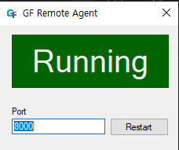
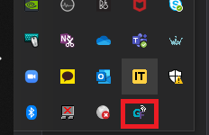
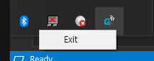
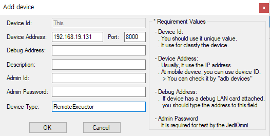

# GF Remote Execution
GFriend provide functionality to execute keywords in remote machine. 


## Preparing Remote machine

To enable this, GF Remote Agent need to be installed and executed in remote machine. GF Remote Agent is included in GFriend release. To run GF Remote Agent, run 'GFRemoteAgent.exe' in GFriend folder.

1. Remote Agent Settings

    Remote agent requires administrator's privilege to execute. It will start GF Remote Agent server with default 8000 port. To change the port edit port and click refresh.

    

2. Remote Agent behavior

    Remote agent UI displays current status of Agent. Even if user close button agent will NOT BE CLOSED, but minimized to task bar.

    

    User can close agent by popup menu in task bar.

    

3. Temporary space for test data

    Remote Agent will use C:\GFRemote for saving test data (files to used by test, test results)


## Preparing Central (Main) Executor

1. Add remote executor in device list
    
    Remote executor is also handled as device. Set the device address with IP address of Remote Executor and port with set value in Remote Agent. (Default port is 8000). Device Id will be used as Remote ID.

    


## Create Remote execution script

1. Declare remote execution by using statement

    By using 'At' in the end of using statement, GFriend will notice that remote executor will be used for script.

    ```javascript
    using JediOmni With Ruby At Remote01
    ```

    Using statement above tells to GFriend JediOmni library will be used with Ruby device at Remote01 executor.

    You can also use variable file and custom library in same way as below:

    ```javascript
    using CopyKeyword.gflib With Diamond At Remote01
    using PrintTest.gfvar At Remote01
    ```

2. Create script with 'Remote Run'

Remote Run declaration should keep following syntax:

```javascript
Remote Run:[RemoteExecutorName]
{
    // Keywords to run in remote executor.
}
```

Remote Run block is executed in asynchronous. So if keywords in Remote Run block do not finished, next line of Remote Run will be started. So you can run script in parallel. Use Wait For Remote Complete keyword to wait remote run block.


## Execute Remote execution script

Executing script with remote execution is just same as normal script. Only user need to check is remote agent is running and remote machine is accessible from Main executor.

After execution, GFriend will collect test results from remote executor and merge them to test report.