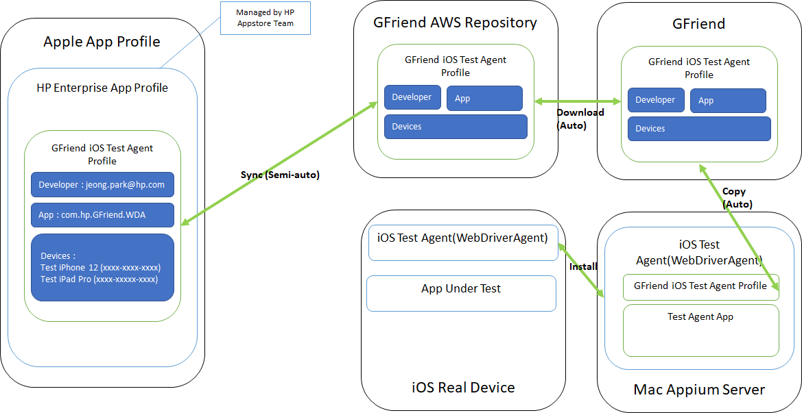
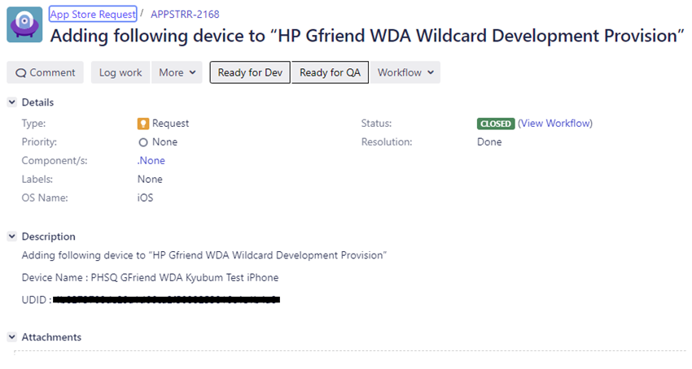
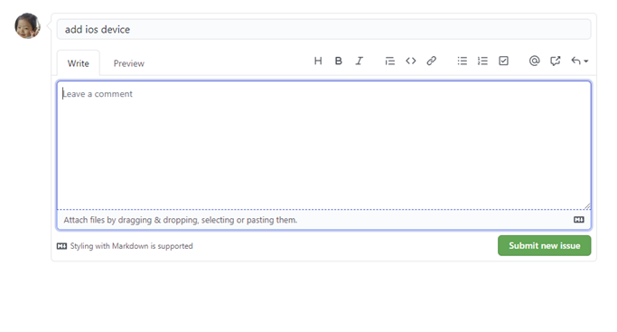
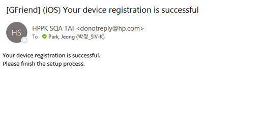
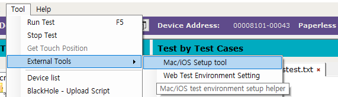
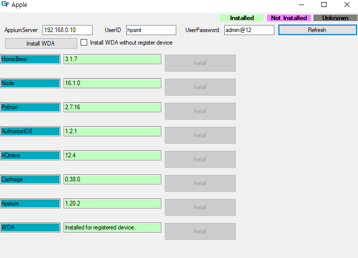

# Setup Mac and iOS Test Environment
For both iOS and Mac application testing, Mac OSX machine is required to serve Appium server. You can use one Mac OSX machine both for Appium server and test device.

## Precondition - For iOS test

### Overview
GFriend uses test agent called WebDriverAgent which will be installed in your test phone. Due to strict policies of Apple, this agent only can be installed with registered device. Apple manages mapping information among developers, apps and devices as profile, you need to add your device to GFriend test agent profile.



Unfortunately normal user can not download this updated profiles form Apple site, GFriend setup AWs repository to store this profile. After you device is registered in profile, you can request sync profile between Apple and GFriend AWS repository.

After syncing, now you can setup your environment using environment setup helper tool.

### Step1. Request Add device to profile

All profiles which is developed by HP, are managed by HP App Store team. To add your device(s) into GFriend Test Agent profile, you have to create JIRA issue.

- JIRA Project : https://jira.cso-hp.com/browse/APPSTRR
- Issue Type : Request
- Title : Add device to HP Gfriend WDA Wildcard Development Provision
- Components : .None
- Description Contains:
    - Device Name : MUST be start with PHSQ GFriend WDA (ex. PHSQ GFriend WDA SST test iphone01)
    - UDID : udid of device
    - Target profile : HP Gfriend WDA Wildcard Development Provision

See example below:



Normally, request is handled within 1 business day.

### Step2. Sync Apple profile to GFriend
**Precondition : JIRA request of step 1 is done. (Profile updated)**

If you create Github issues, sync process will be automatically started.

1. Go to Github Enterprise WDA Repo : https://github.azc.ext.hp.com/HP-SMT/WebDriverAgent/issues

1. Create new issue with title of **add ios device**


1. Email will be sent, and issue will be closed if sync is done



## Appium Server Requirements
To setup Appium server with setup helper tool, you need follow below steps first:

1. Enable ssh & disable sleep
	1. System Preferences - Sharing : Check Remote Login

1. Install Xcode (in Mac)
	1. Download XCode binary from http://developer.apple.com/download/more
	1. Open Xcode_xx.xx.xip
	1. Copy uncompressed file to /Applications
	1. Run Xcode and agree license agreement

    or you can install Xcode via AppStore

1. Enable for Accessibility access for Xcode Helper for Mac testing (in Mac)
	1. Open System Preferences - Security & Privacy - Privacy - Accessibility
	1. open /Applications/Xcode.app/Contents/Developer/Platforms/MacOSX.platform/Developer/Library/Xcode/Agents/
    1. Drag & drop Xcode Helper to Accessibility

## Install all dependencies with Helper Tool

Helper tool (Apple.exe) support to install all dependencies for Mac/iOS testing. You can run this tool in GFriend menu.



You can install all required component for Mac/iOS test.



NOTE : All other component except WDA can be installed before registering device. WDA must be installed after registering device and syncing profile.

## Setup Android2 Test Environment

Android2 library uses Appium to communicate with Android devices.

### Topology and connectivity

- **Windows client** runs GFriend.
- **Remote Appium host** runs Node.js/npm, Appium, UiAutomator2 driver, Java, Android SDK Platform-Tools (`adb`), and SSH.
- **Android device** is connected to the remote Appium host (USB or ADB over TCP/IP).

Windows (GFriend) must be able to access the remote host on:

- Appium port (for example `4723`)
- SSH port (typically `22`)

### Precondition

- A remote machine is available to host Appium and SSH.
- The Android device has **USB Debugging** enabled (Settings > Developer Options > USB Debugging).

### Step 1. Install Homebrew (Mac, if applicable)

```bash
/bin/bash -c "$(curl -fsSL https://raw.githubusercontent.com/Homebrew/install/HEAD/install.sh)"
```

### Step 2. Install Java JDK

```bash
brew install openjdk@21
```

### Step 3. Install Node.js & npm

```bash
brew install node
```

- Node.js: https://nodejs.org/

### Step 4. Install Android command line tools

```bash
brew install --cask android-commandlinetools
```

### Step 5. Install Android SDK Platform-Tools (`adb`)

Android Studio is **optional** and is not required by Android2.

```bash
sdkmanager --install "platform-tools"
```

Set environment variables (for example in `~/.zshrc`):

```bash
export ANDROID_HOME=$HOME/Library/Android/sdk
export PATH=$ANDROID_HOME/platform-tools:$ANDROID_HOME/tools:$ANDROID_HOME/tools/bin:$PATH
```

Reload shell config:

```bash
source ~/.zshrc
```

### Step 6. Install Appium and UiAutomator2

```bash
npm install -g appium
npm install -g appium-doctor
appium-doctor
appium driver install uiautomator2
```

### Step 7. Verify `adb` and device connectivity

```bash
adb version
adb devices
```

The Android device should appear with status `device`. If it shows `unauthorized`, accept the USB debugging prompt on the device.

### Step 8. Start Appium with Android2-compatible endpoint

Android2 connects to the `/wd/hub` endpoint. Start Appium on the remote host with:

```bash
appium --address 0.0.0.0 --port 4723 --base-path /wd/hub
```

GFriend `Port` must match the Appium `--port` value.

### Step 9. Configure device fields in GFriend for Android2

Set `DeviceType = Android2` and map fields exactly as follows:

- `DeviceAddress`: Appium server hostname or IP address
- `Port`: Appium server port
- `LanDebugAddress`: Android device ID returned by `adb devices`
- `AdminId` and `AdminPassword`: SSH credentials for the Appium host (for example `<SSH_USER>` and `<SSH_PASSWORD>`)

> NOTE: Once Appium is running and `adb devices` lists the target device, Android2 can connect through the remote Appium host.
