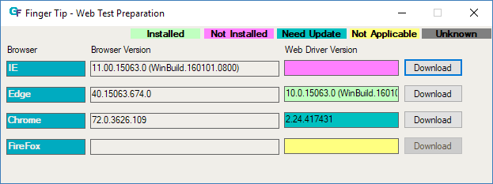

# Web Test Environment Setup Helper : Finger Tip

Finger Tip is helper tool that automatically download proper web driver for currently installed web browser.

Each web browser need compatible web driver for testing web-based software. GFriend support Internet Explorer, Edge, Chrome and Fire Fox for web testing. This tool help to install web driver for those browser.

## 1. Launch

This tool can access via GFriend UI (Tool - External Tool - Web Test Environment Setting)

## 2. Check Status

You can check Web driver status by colored lable.

## 3. Download Web Driver

If proper version of web driver is avalable in the developer's site, this tool can download web driver by just clicking Download button.

## 4. Start Web Testing

You can use browsers which have proper web driver (Indicated as 'Installed') at your test such as Open With Edge.

