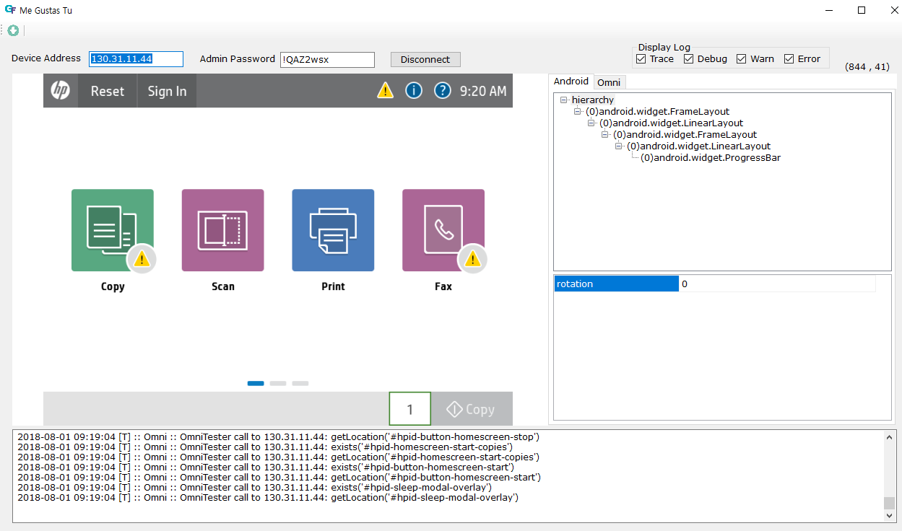
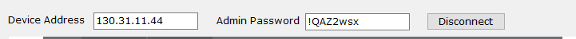
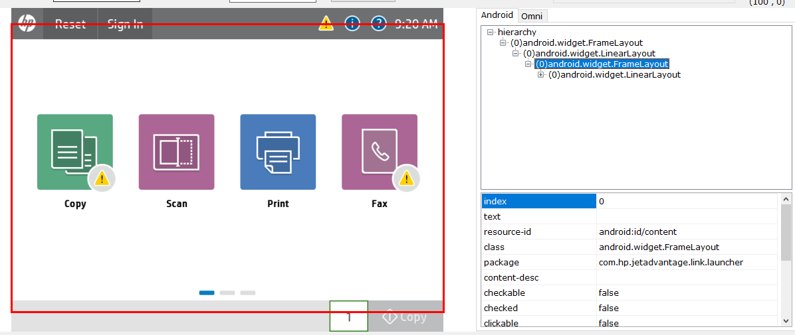
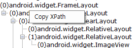
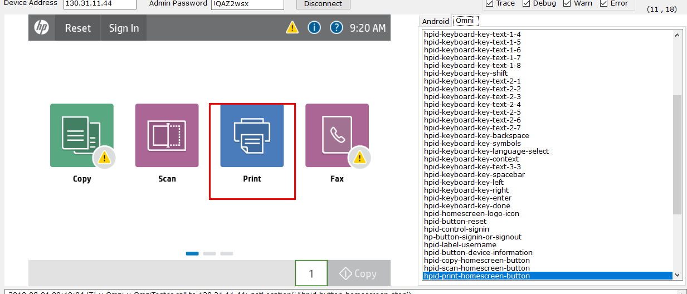
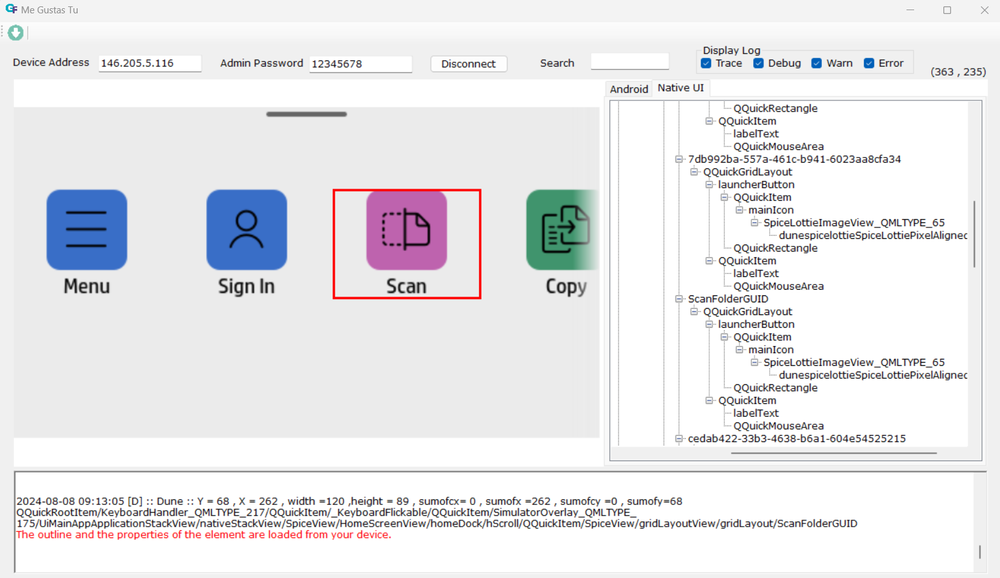

# UI Inspector : Me Gustas Tu

Me Gustas Tu is UI Inspector which helps get Android's UI hierarchy and Jedi Omni's IDs with screen shot.

## 1. Connection

 - Device Address : Enter device ip (in case of LAN connection) or device id (in case of USB connection)
 - Admin Password (Optional) : If this field is filled-up, tool will connect to both Android and Omni, if not tool will connect to only Android

 If you start this tool within GFriend UI, these field will be filled and connect automatically.

 NOTE: Disconnect form device by clicking 'Disconnect' button before running test.

## 2. Dump UI

 You can start UI inspection by clicking  button.

 Tool will get the screenshot of device, UI hierachy info of Android and list of OmniIDs on current page (if Omni connected.)

## 3. Inspect UI

 You can see the information of object by clicking screenshot in left pane, tree-view (Android) or list item (Omni) in right pane.

 1. Android

   

   If tab of right pane is selected as Android, you can see the android object info.

   You can use text property (ex. Touch Text) or resource-id property (Touch ID) in your GFriend Script.
   
   Or you can also use XPath of element in your script. By clicking right mouse button on treeview, you can see the menu of Copy XPath. If you click this XPath of selected element will be copied to clipboard.

   

 2. Omni

   

   If tab of right pane is selected as Native UI, you can see the list of Omni IDs.

   By clicking mouse right button, you can copy the selected id to clipboard.

 3. Dune

   
   
   If tab of right pane is selected as Native UI, you can see the list of Dune IDs in a tree structure.

   You can search the id by typing the text in the text box next to Search.
   
   By clicing on the nodes in right pane , the image on the left pane will be highlighted. Also will get the hierarchy of the selected node in the below text box.

   