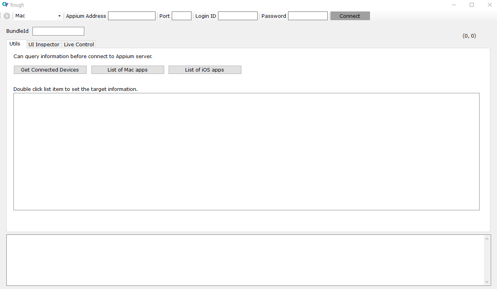
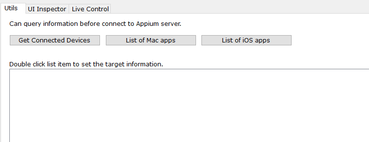
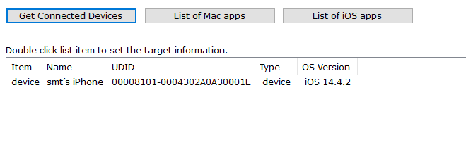
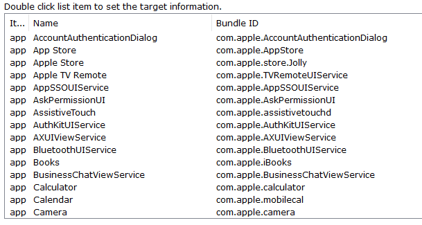
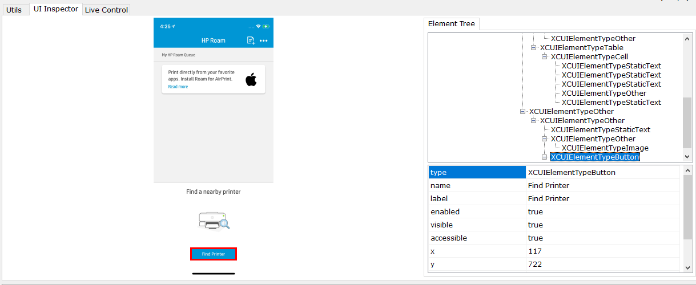
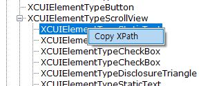
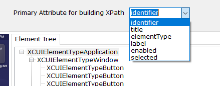
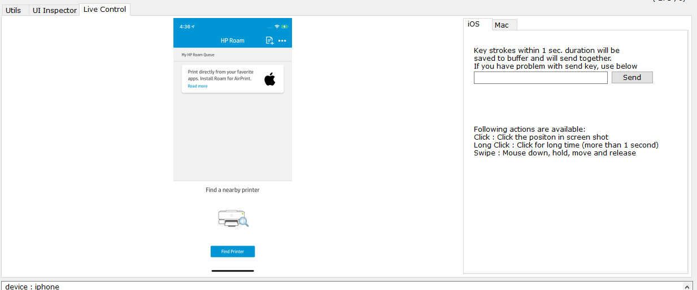
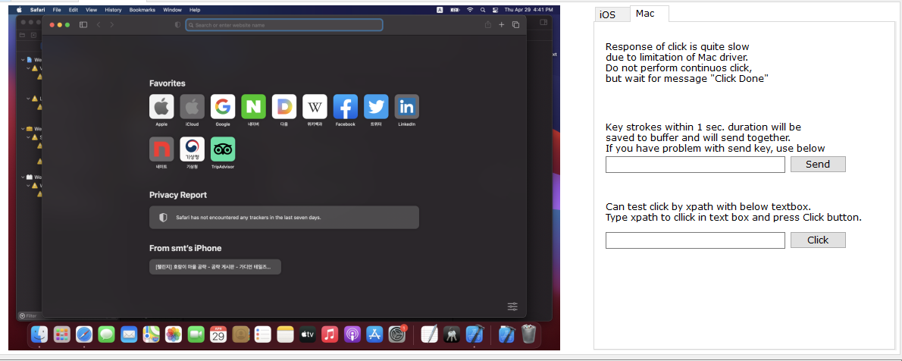

# UI Inspector for Mac and iOS : Rough

Rough is tool for inspecting UI element for Mac and iOS. This also has capability to control(touch, swipe and send text) device remotely based on Appium connection.

You can choose target device type (Mac or iOS) in the combobox located on left upper corner.

## Precondition

All required component for Mac/iOS testing should be setup in Mac PC that serves Appium server (including enable ssh connection to Mac PC.)

## Utilities

In the tab "Utils", you can query device's information which are required to connect to Appium server. Of course, this is not require connection, but we have to set Appium server address, port, Login ID and Password.

### 1. For iOS Testing
- Get Connected device

    By clicking "Get Connected Device" button, you can get list of active devices which is connected to Mac PC.

    

    If you double click the list item, device information (UDID) will be applied in UDID text box.

- List of iOS Apps

    By clicking  "List of iOS Apps" button, you can get list of installed app on iOS device.

    

    If you double click the list item, app information (bundle id) will be applied in bundle id text box.

If you filled out all desired field for iOS testing (UDID and Bundle ID), now you can connect to iOS device via Appium then you can do inspect and live control.

### 2. For Mac Testing
- List of Mac Apps

    By clicking  "List of Mac Apps" button, you can get list of installed app on Mac device.

    

    If you double click the list item, app information (bundle id) will be applied in bundle id text box.

If you filled out all desired field for Mac testing (Bundle ID), now you can connect to Mac device via Appium then you can do inspect and live control.

## UI Inspector

UI inspector feature is same for both iOS and Mac. After connect to Appium server with desired information, you can dump UI hierarchy and screen shot from device by clicking dump button .

By clicking screen shot area, tool will automatically focus element in Element Tree. You can check properties for testing.

You can also use XPath of element in your script. By clicking right mouse button on treeview, you can see the menu of Copy XPath. If you click this XPath of selected element will be copied to clipboard.

Tool uses identifier attribute as a primary attribute to build XPath. You can change this with by selecting attribute in combo box as below image.

## Live Control

### 1. iOS Live Control
You can click, long click, swipe and send text with live control.

### 2. Mac Live Control
You can click and send text with live control. Due to limitation of Appium Mac driver, clicking by position (Click with mouse on the screenshot) is quite slow. You must wait until "Click Done" message on output before performing next action. For better clicking performance use click by xpath in right pane.

