# GFriend Git Client

Note : GFriend git client is only available on 64bit Operating System.

## Preparation

1. Acquire HTTP Access Token

    Log on to Github and goto settings. (Click your account in top left and select Settings.)

    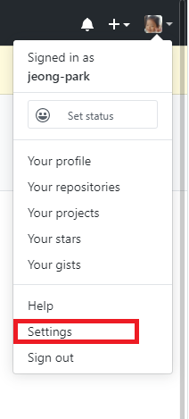

    Goto Developer Settings - Personal Access Tokens

    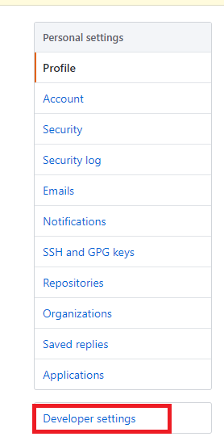 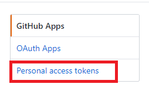

    Click Generate New Token

    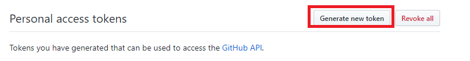

    Fill out Note (That you can easily recognize of your purpose later) and check "repo" checkbox than click Generate Token button in the bottom.

    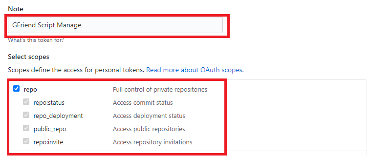

    After click Generate Token button, you will can see the access token as below. To copy it to clipboard, click copy icon (red box).
    
    **NOTE : if you leave this page, you WILL NOT see the token again.**

    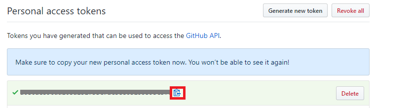

1. Set your information in GFriend Git Client

    Click Git icon which located just above folder explorer. Then Git client will be displayed. (If you click Git icon again, Git client will be disappeared.)

    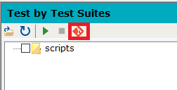

    In the Client, click settings button.

    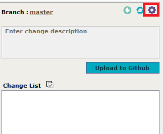

    Fill out User name, Email and HTTP Token in Global Config section and click Save button.
    
    **NOTE: Your http token will be saved as a file(gfGitConfig.xml) with encryption. This file only can be decrypted in the PCs that you saved.**

    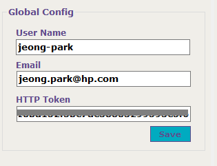

    Note: Your user name also can be found in home page of Github.

    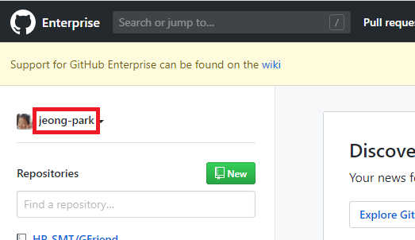

    

## Clone a new Repository

You can clone new repository from Github. Go to Github repository to clone and get clone URL. Click Clone or download button in the repository and get clone URL to your clipboard by clicking copy button.

If you see Clone With SSH instead of Clone With HTTPS, click Use HTTPS to get HTTPS based URL.

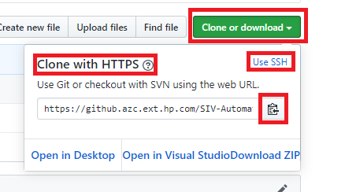

Go back to the GFriend Git client settings, fill out Clone URL and select folder to clone. (NOTE: Destination folder must be empty)

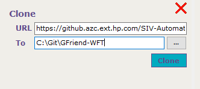

After few secondes (it depends on size of repository) clicking Clone button, you will see the message in GFriend output window as below:

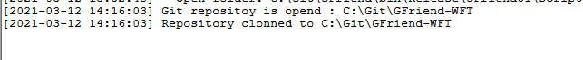

Also GFriend will set your script root to cloned folder.

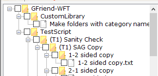

## Using existing Git local repository

If you already have local repository, you can just open folder.

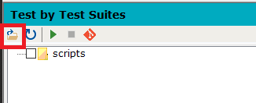

## Basic Operations (Branches, Pull Changes)

1. Sync

    If there is new updates on remote repository (Github), you can pull the changes with Pull button. After few seconds clicking Pull button (it also depends on size of changes), you will see complete message (Sync with Github.) in output window.

    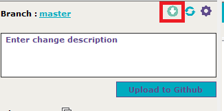

    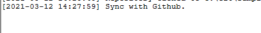

1. Branches

    You can change or create branch in GFriend Git client. Click branch name then branch selector will be displayed.

    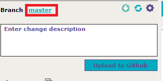

    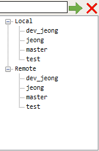

    Select one of branch in the tree or type new branch name on text box. Click Green arrow button will change (checkout) branch to your selection.

    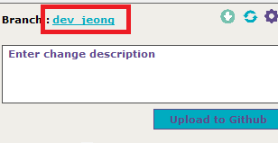

## Working with changes

1. Upload Changes to Github (Add, Stage, Commit and Push)
    After changing files in your local git repository, you will see changes in GFriend Git Client.

    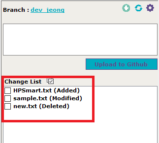

    Select (check) file(s) which you want to upload.

    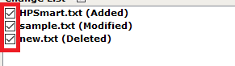

    Enter change description and click Upload to Github button then changes will be uploaded to the Github. (Add, Stage, Commit and Push operations of git will be executed at once.)

    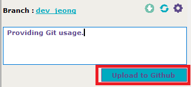

2. Check uploaded changes in Github

    Go to Github repository and change branch which you've selected in GFriend Git Client.

    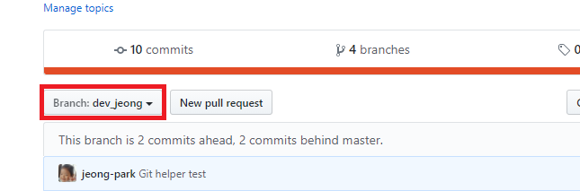

    If you click commits buttons, you can see your uploaded changes.

    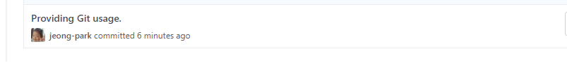

3. Create Pull Request

    To merge changes in your branch to other branch(e.g. master), Go to Pull Request and Click New pull request button.
    
    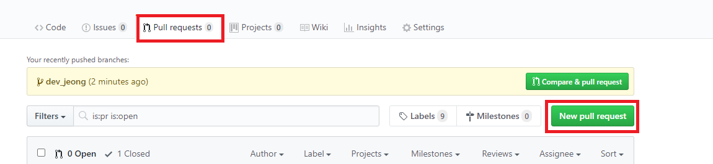

    Select compare branch(your branch) and base branch(branch to merge change) then click Create pull request button.

    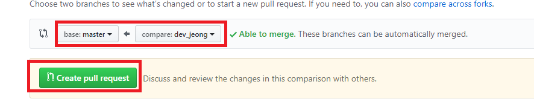

    You can leave comments of pull request and assign reviewers.

    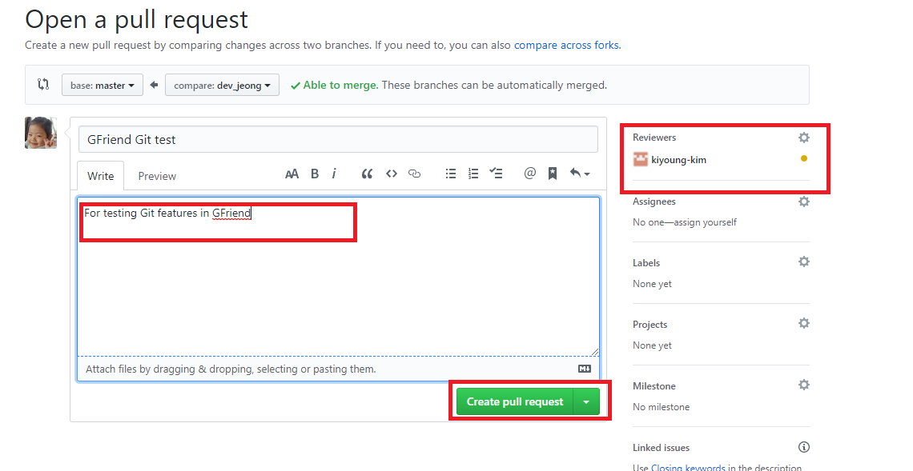

4. Merge Pull Request

    After pull request verification (ex. review done), you can merge your pull request to base branch.

    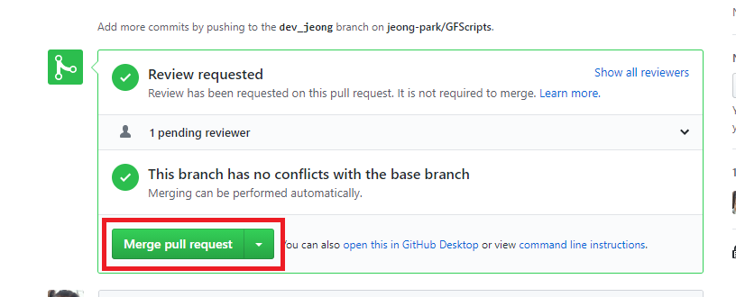

