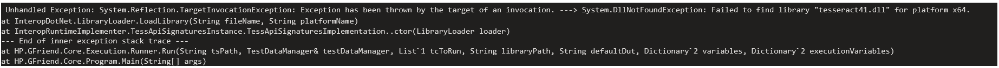

# GFriend Pre-requisities

## Existing Tesseract issue
Few users reported : When tried to open Gfriend on machine, even if we double click the exe file or run it as an admin, nothing happened, and there is no process running in the task manager as well and getting below error

It is a known issue as per the link https://github.com/charlesw/tesseract/issues/493 

## Steps to resolve the above Tesseract issue 
Please install Microsoft Visual C++ Redistributable for Visual Studio 2015, 2017 and 2019 by following below steps.
1.Go to the official Microsoft website:
Microsoft Visual C++ Redistributable Downloads

2.Download and install the supported versions:
Microsoft Visual C++ 2015–2019 Redistributable
Any version in the 14.x family is supported.
Ref this link https://learn.microsoft.com/en-us/cpp/windows/latest-supported-vc-redist?view=msvc-170

3.If users require a specific Visual C++ version:
Contact the GFriend Team for assistance.

