# GFriend UI
### GFriend - Test Tool with user script
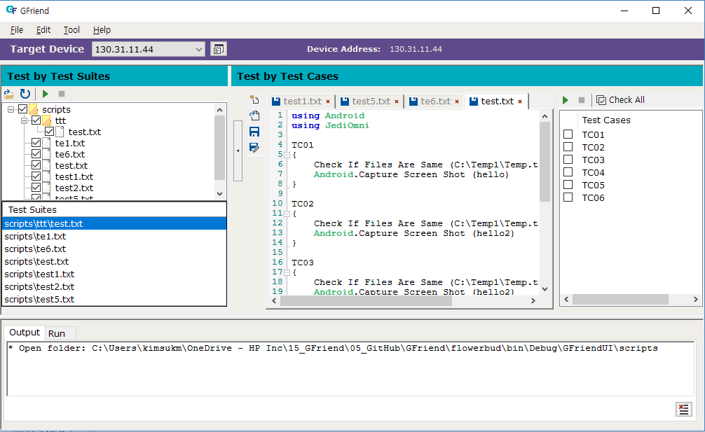

1. **Test Running** 
	1. **Makes new TC**		
		* You can make new TC from editor text on GFriend Tool.
		* When you makes new file or open existing file, it displyed separated tab on Test by Test Cases.
		* Simple guide for Statement
			+ Each test case is separated by "{}". When you write "{" after test case name and write "}" after test case, the tc is automatically added on Test Cases list.
			+ If you want to use specific library like the Android, JediOmni, etc. , test case would include "using [library name]" for load the library.
			+ After loading libraries, you can use auto complete menu for each library and keyword on the library.
		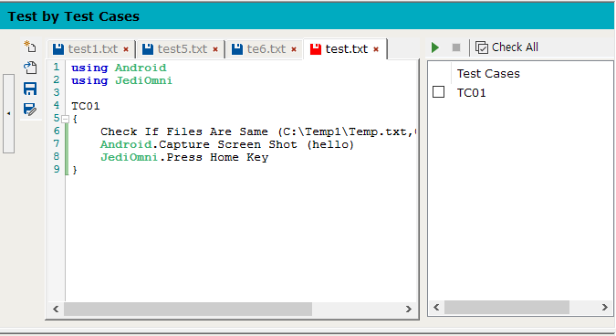

	1. **Register the test device**		
		* You can display device list by "Option > Tool > Device list" or "Device list button" on Targer Device layer.
			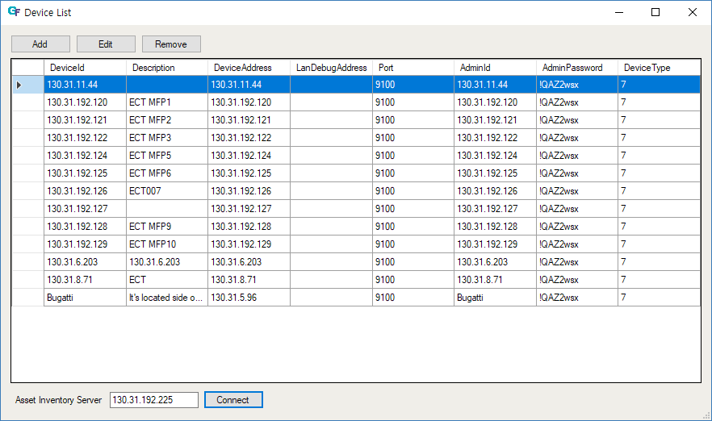

		* Get the device information from Asset Inventory server
			+ You can find "Asset Inventory Server" text field and "Conncet" button below the Device list
				1. Typing Asset invertory server address on the text field. (**Default value is STB asset inventory server on hppk**)
				1. Click the Connect button 
					* If the server address is valid, the device list on asset inventory server display to new device list.
				1. Select one device that you want to add the GFriend device list
				1. Click "" button located on the middle of the device list form
			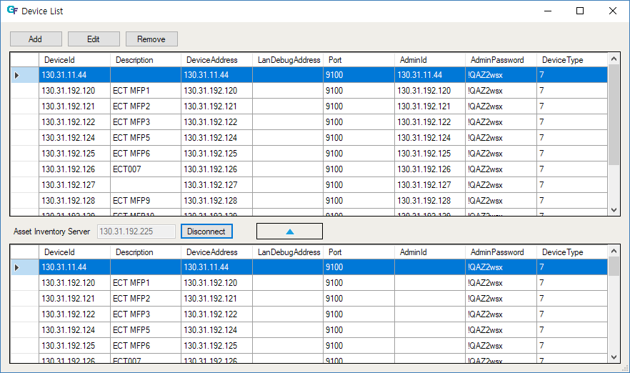
			
		* Register the device by manual typing
			+ If you want to register new device on the list, click add button on the list.			
				- **At now, the three fields are required for testing**
					* Device Id: You should use it unique value. It use for classify the device.
					* Device Address: Usually, it use the IP address. At mobile device, you can use device ID.
					* Debug Address: If device has a debug LAN card attached, you should type the address to this field  
					* Admin Password: It is required for test by the JediOmni.
				- **For iOS/Mac testing***
				    * Appium server information should be given (see descriptions)
				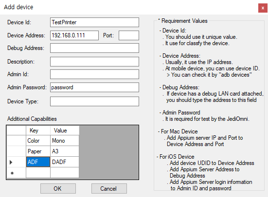		

			+ Also you can add device's additional capabilities and use in your script. If additional capabilities are given, you can refer their value with system defined variable : ${DUT_[Capability Key with Upper case]}. For example, you can get 'Mono' with variable ${DUT_COLOR}, 'A3' with variable ${DUT_PAPER}.

	1. **Select device for test by test suites and test cases**
		* You can select device from device list combobox located in right of the Target Device text.
		* The combo box display all list of the device list form.
		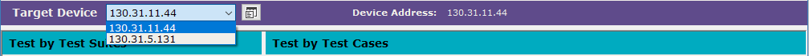

	1. **Run test**
		* **Test by Test Suites**			
			+ You can run by selecting test suites on file list tree view on left side of the GFriend tool.
			+ Each test suites unit is file that have extention to ".txt" or ".gfscripts"			
			+ You can change displayed fil list fodler by clicking Open folder icon above the file list tree view.
			+ If you double click mouse button to the file list tree view or select open file after right click on the file, the file is opened to the text editor with new tab.
			+ When you right click item on the file list tree view, it display context menu for controlling file or directory
				- New File/Folder, Remove File/Folder, Open Folder, Open Folder in File Explorer.
			+ When "Run" button clicked in the Test by Test Suites layer, all selected test suites are run in order.			
			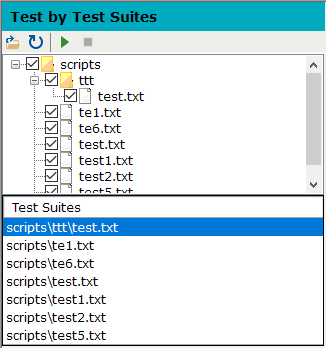

		* **Test by Test cases**			
			+ You can run by selecting test cases on test cases on right side of the GFriend tool.
			+ Each test cases is separated by "{}".
			+ When you change tab on the editor text, the test cases list automatically updated by selected tab.
			+ Before testing, the test suites would be saved to latest code.
			+ When you right click to item on the tab. it display context menu for controlling the file.
				- Save, Save As, Open Folder, Open Folder in File Explorer, Close, Close All, Close All But This.
			+ When "Run" button clicked in the Test by Test cases layer, all select test cases are run in the order.
			

		* **Test by one keyword**			
			+ You can run one keyword by text run layer on bottom side of the GFriend tool. It exist on other tab on right of the output layer.
			+ It doesn't save to specific file. You use it for simple testing for making new test case.
			+ Before testing, it would be pre-required connecting to specific device from its Target Device combo box.
			+ Also need to select libries to test with "Select Libraries" menu.
			+ Connecting for this test would be disconnected when test by test by Test Cases/Test Suites is run.
			+ When "Run" button clicked in the test by Text Run layer, the typing keyword on textbox is run.
			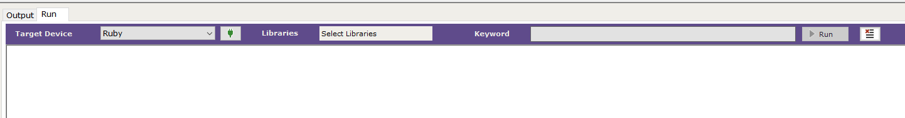

		
	1. **Test result**	
		* Test Result from local GFriend
			+ Simple result is displayed on output layer on bottom side of the GFriend tool.
			+ Report about test result is saved to specific file about each test suite.
			+ When you click the link on output layer, the report is executed to internet browser. The report has detail result about the test.
			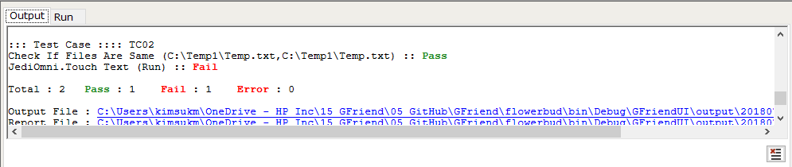
				

1. **More information** 
	* **Keyword List**		
		* You can check this option from "Option > Help > Keyword List > [Library Name]"
		* You can get all keyword list about each library from this menu when clicking the library name.
		* The keyword list display the documents included keyword list by internet browser. 
		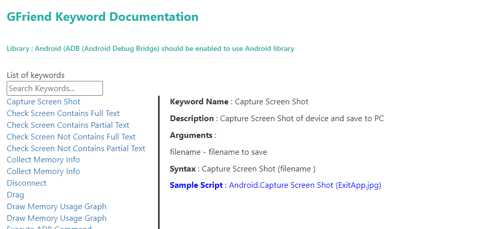
		

	* **External Tools**
		* UI Inspector ([UserManual](../GFTools/MeGustasTu/README.md))			
			+ You can execute UI Inspector from "Option > Tool > External Tools > UI Inspector".
			+ This tool support making test case. You can get info for Android and JediOmni object ID from this tool.
			+ This tool get Device Address and Admin Password from selected device on Target Device combo box when you run it.

			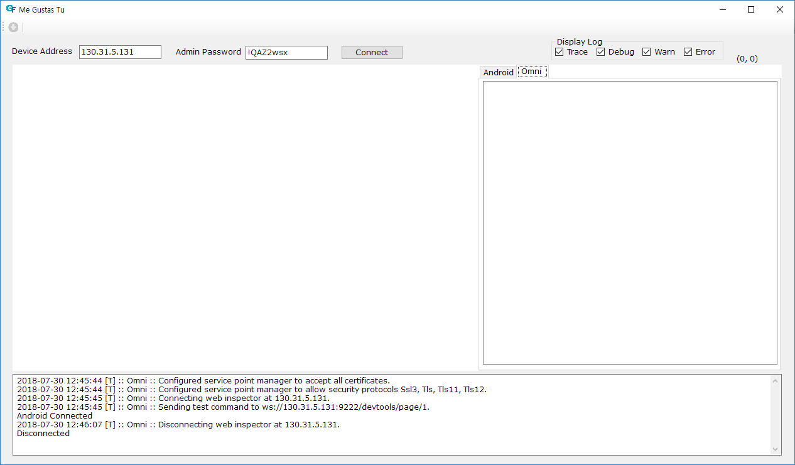
 
    * **Git Integration**
	    
		GFriend provides built-in Git client for managing test script with Git/Github. See more detail in ([Git manual](../GFUtils/GitHelperControls/README.md))

    * **What's New**

	    * You can check this option from "Option > Help > What's New".
		* In the "What's New" info box located at the bottom-right corner of GFriend, contains the following links. Click the respective links.  These links will take you to the more documentation pages from GFriend2 Viva Engage page. Sample links like below are shown. This content will be keep changing based on the new features.
			+ A video showcasing the new features of GFriend
			+ A video guide for keyword documentation
			+ A video tutorial on fetching Window Automation IDs
			+ A video on using the Dune UI Inspector

		    

	* **Co-Developer**
		* The GFriend CoDeveloper makes the users easy to write test cases.
		* By default, CoDeveloper mode is turned off. When the user clicks the "CoDeveloper Mode" button on the top right corner, CoDeveloper activates, and a "Co-Developer" tab appears at the bottom.
		* Once CoDeveloper is activated, as the user starts writing the script, the relevant keyword details such as "description, syntax, and sample script" are displayed in the CoDeveloper tab.

		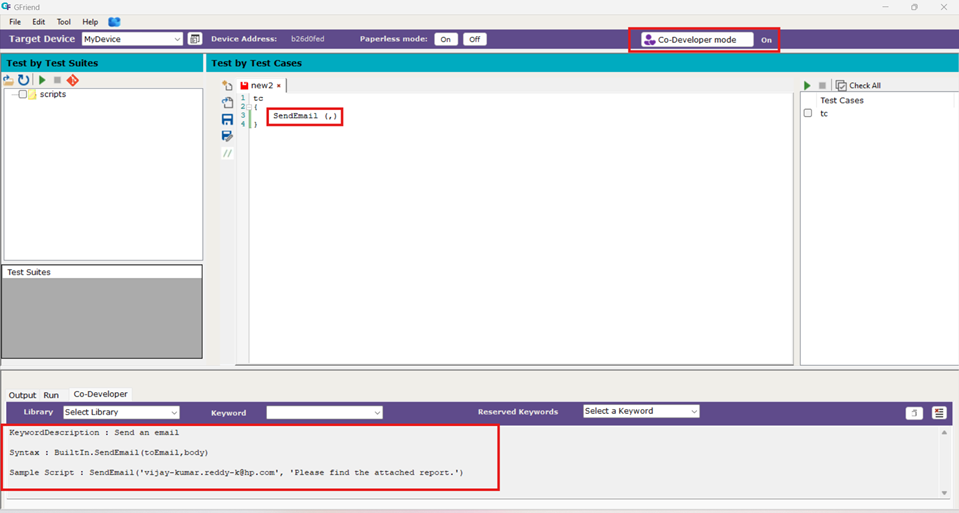

		* Additionally, there is another way to access keyword details. In the CoDeveloper tab, there is a dropdown menu for selecting a library and a keyword. When a user chooses a library from the dropdown, all the keywords within that library are displayed in Keywords dropdown. Selecting a specific keyword will show its details such as "description, syntax, and sample script".

		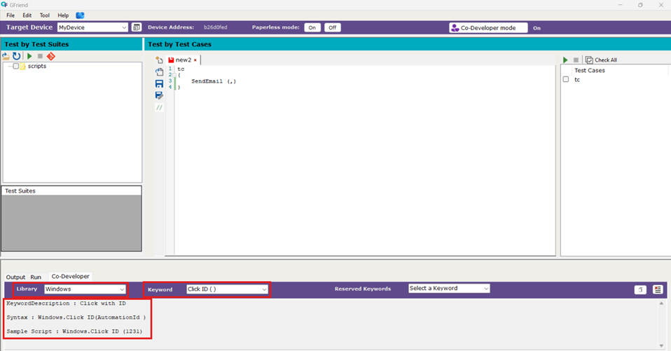

		* Furthermore, there is another dropdown for selecting reserved keywords like "repeat," "for," "foreach," and others. When a user picks one of these keywords, its details such as description, syntax, and sample script will be displayed.

		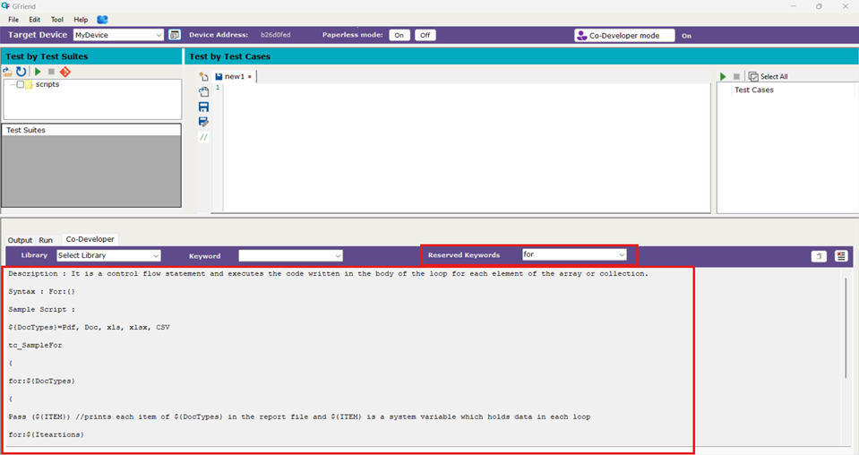

		* Also in the Co-Developer tab, there is a copy button that allows users to copy the sample script for the selected keyword and paste it into the editor using (Ctrl+V).

		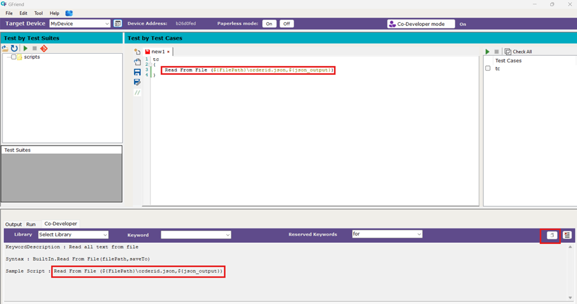

		* There is also a Clear button next to the Copy button in the Co-Developer tab, which allows users to clear the text in the Co-Developer tab textbox

    * **Chatbot**
		* The GFriend Chatbot allows users to quickly access details about GFriend, including its libraries and keywords, without manually searching through Help → Keyword List in the GFriend UI.

        * A chat icon is available at the bottom right corner of the GFriend UI. Click on it to open the GFriend Chatbot.

		   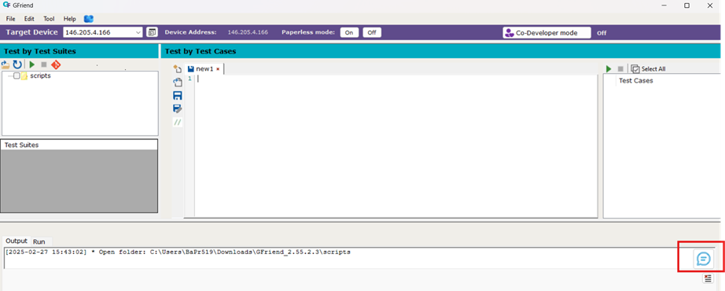

        * By default, the chatbot displays general information about GFriend along with a menu.
		
		   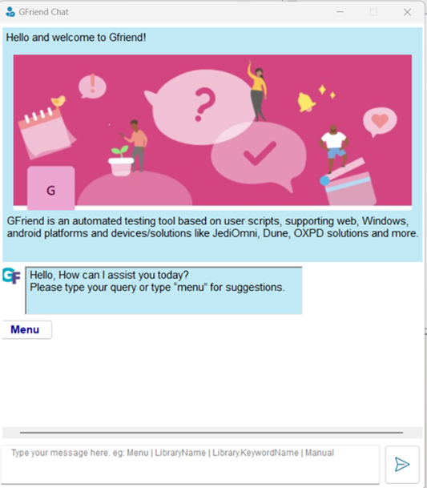

        * Clicking on the menu lists a few libraries. Selecting any library will navigate the user to its documentation, where available keywords can be explored.

		   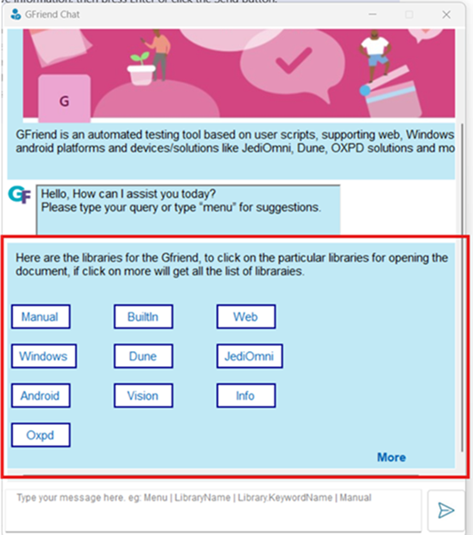 

        * An additional More option in the menu displays all available libraries. Clicking on any library provides further details.

		     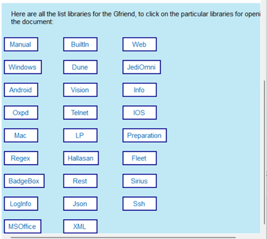 

        * Chatbot Commands:
            Users can enter text-based commands to retrieve information, then press Enter or click the Send button.

		  * Library Name → Navigates to the documentation for the specified library.

             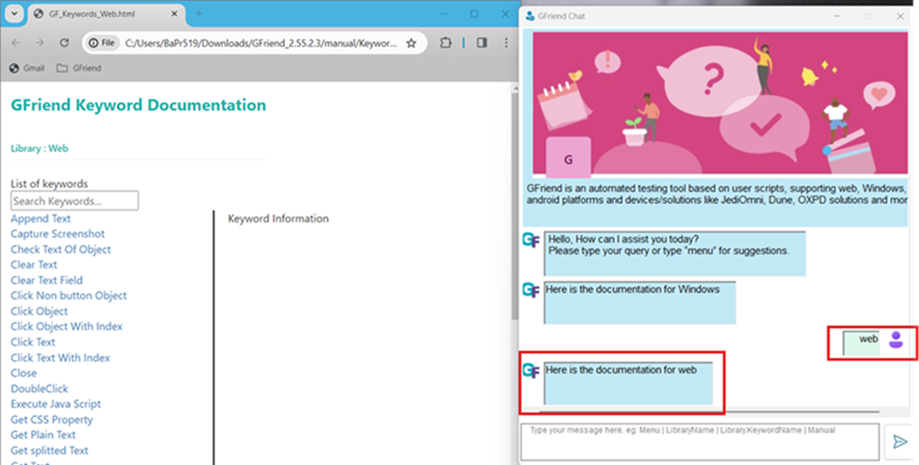

          * Library.Keyword Name → Displays details such as the keyword description, arguments, and a sample script.

		    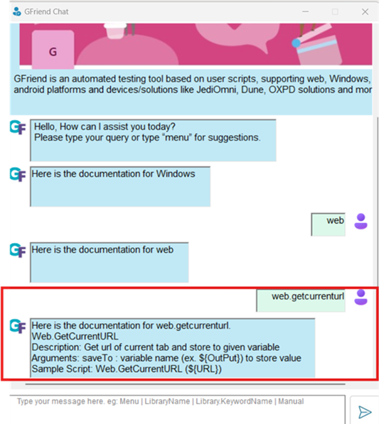

          * Menu → Lists a few libraries. Clicking on any library directs the user to its documentation.

		    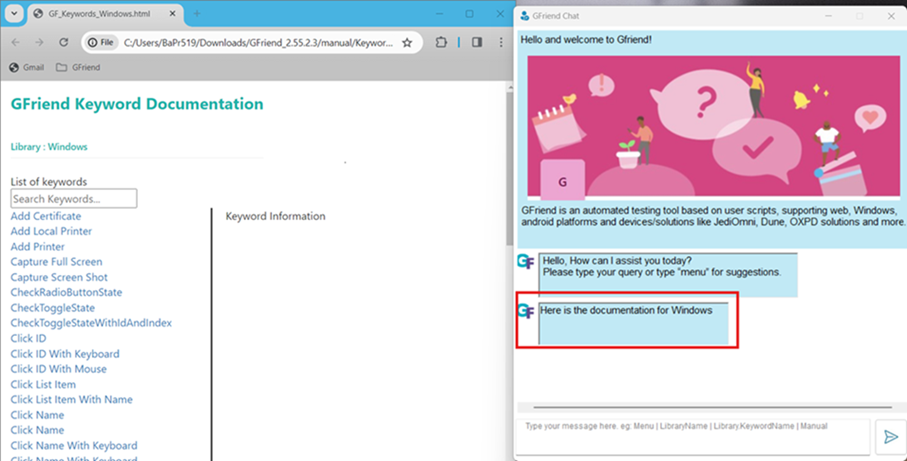
		    
          * Manual → Navigates to the manual documentation, which provides information about GFriend and its usage.

		    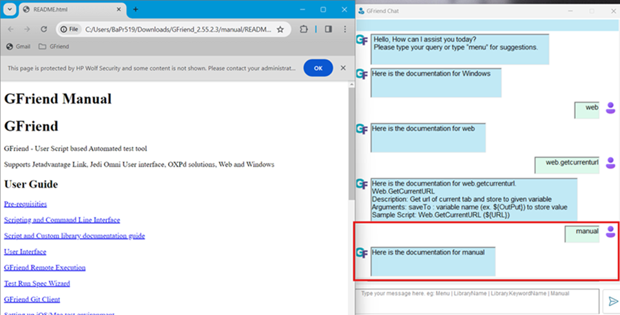

          * Random Text → If the entered text is unrecognized, the user is redirected to the manual documentation, which also contains library-related details.
		  
		     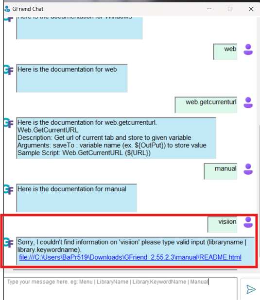
			 

	*   **Encrypted Variables**     

	      * You can check this option from "Option > Tool > Encrypted Variables".

		    

			* This new option is added in the GFriend menu strip for adding encrypting values.
			* This way we can restrict the passwords, IP Address, API Endpoints directly visible in the scripts. which may be mis-used by the others.
			* This feature allows storing and managing key–encrypted value pairs. Data is saved securely in an XML file.
			* AES encryption is used to protect the values.
			* Encrypted values are shown as dots (.............) in a DataGridView.
			* Users can add any number of variables and encrypted values into XML File.
			* Values can be decrypted using the GetDecryptValueByKey keyword.
			
           *  Process to Add a New Encrypted Variable:

				* Enter the Name and Value, then click the Encrypt & Add button.
				* The value will be encrypted and saved in an XML file.
				* The list of variables are shown in Tabular Form. You can either add or delete the Variables.

		  *  Using the GetDecryptValueByKey Keyword:

				* The GetDecryptValueByKey keyword is used to get the original (decrypted) value.
				* It reads the encrypted value from the XML file and decrypts it.
				* The decrypted value is stored in a variable, which can be used anywhere in the GFriend Script—such as in a text field or any required location.

		  *  Handling Encrypted Variables in STF/STB:	
		  		
		        * STF/STB users do not have access to the GFriend design and therefore cannot view the "Encrypted Variables" table.

				* To resolve this limitation, two keywords have been introduced: Encrypt and Decrypt, which allow users to securely handle sensitive data.

				* Encrypt Keyword

					Syntax: Encrypt(rdl******admin, ${rdldec})

					Function: Encrypts the value rdl******admin and stores the encrypted result in ${rdldec}.

				* Decrypt Keyword

					Syntax: Decrypt(y60kSN19O5fEupE6I1mjkQ==, ${rdl*})

					Function: Decrypts the encrypted string y60kSN19O5fEupE6I1mjkQ== and stores the plain (original) value in ${rdl*}.
