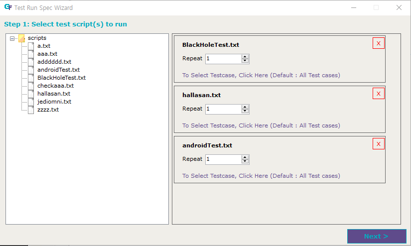
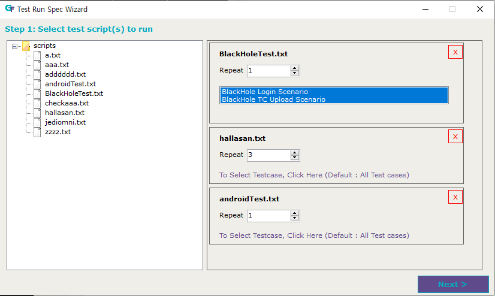
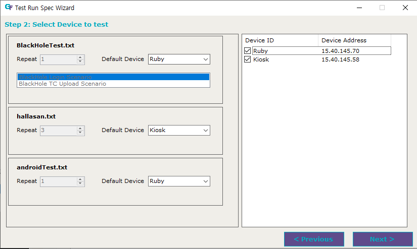
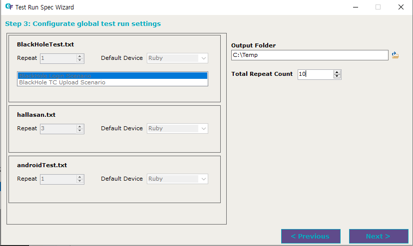
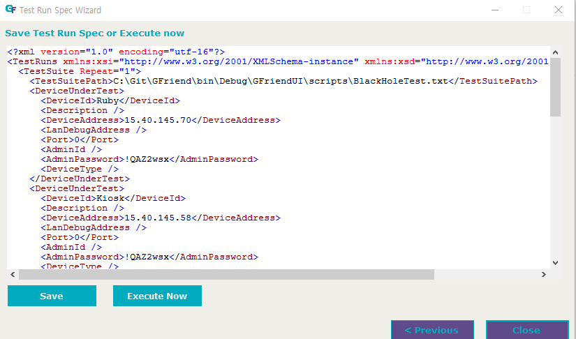
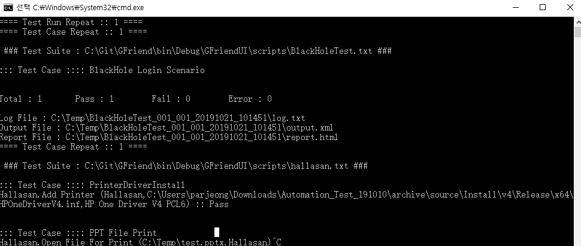

# Test Run Spec Wizard

This menu helps to create GFriend test run spec. xml file within UI.

Tester can access this menu via Tool - Test Run Spec Wizard.

## Step1. Select test script(s) to run

You can selet test script files to run by clicking file name at file browser tree in left pane.
If you want to run same script with different configurations (repeate count, test case selection or devices), you can add same script file. (Press 'X' icon to remove script for list.)

In script configuration, you can select repeat count and test case to run if you wants.

## Step2. Select Device to test

In this step, you can select deivces under test and select default device for each test script.

## Step3. Configurate global test run settings

In this step, you can configure global settings of entire test run. 

Specify output folder which test results are saved. GFriend will create seperate output folder based on each repeatation under given output folder.

You can repeat entire selected tests with set the total repeat count. If one script's repeat count is 3 and Toatl repeat count is 10 (for example hallasan.txt test script in above screenshot), the script will repeate 30 times (3 x 10 times) in this test run.

## Final step. Save test run spec or Execute now

You can save test run spec to file for future use, or execute with this test run spec.

After save test run spec, you can run with this spec file in windows command window. Run "GF_Runner.exe -s [SpecfileName]" to run with spec.

If you click Execute Now button, GFriend will run the test with spec in new command windows. This command window is sperate process with GFriend, so it will remain even after GFriend UI is closed.
