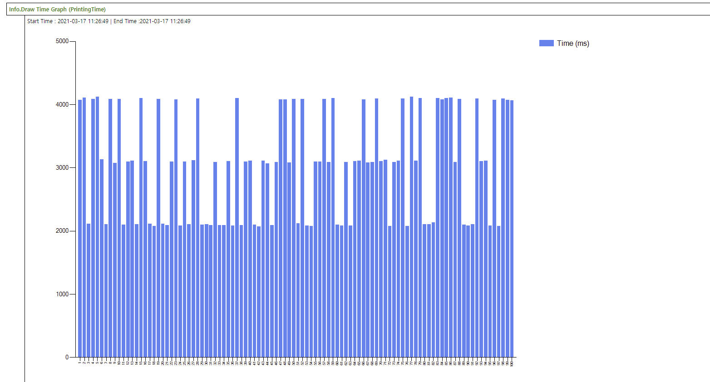

# Info Library

Info library provides keywords for measuring performance during execution. Please note that time of result is not accurate enough but see the trend to identify performance issues.

## Basic Time Measure
Following sample script just provides usages of Info library. All other actions such as app launch or login are replaced to comment or Random Sleep.


```javascript
using Info


Sample Performance Check 
{
    Info.Start Time Check (LoginTime) // Define measure set for Login Time
    Info.Start Time Check (PrintingTime) // Define measure set for Printing Time
    
    @Repeat:100
    {
        // App launch
        // Check Login Screen
        
        Info.Mark Start (LoginTime,${R}) // Set start point of login time
        // Login script will be placed
        Random Sleep (1,3)
        Info.Mark End (LoginTime,${R}) // Set end point of login time
        
        // File select
        // Set Print options
        
        Info.Mark Start (PrintingTime,${R})
        // Waiting until printing is done
        Random Sleep (2,4)
        Info.Mark End (PrintingTime,${R})
    }
    Assert Last Repeat (Pass,>99)
    
    Info.Draw Time Graph (LoginTime) // Generate graph for login time
    Info.Draw Time Graph (PrintingTime) // Generate graph for printing time
}

```

After execution, you can see the result of time measure data in CSV format in your output folder and also you can see trend graph in the report as below:



## Link STF DeviceWorkflowMarker with GFriend Measure Set

If you run the GFriend script inside GFriendExecutionPlugin within STF/STB, you can link measure set with Device Workflow Marker(Performance Marker) as below example.

```javascript
using Info

STF Auth Perf Marker
{
    Info.Start Time Check (STF_Authentication)
    Info.Start Time Check (STF_AppShown)
    
    Info.Mark Start (STF_Authentication,1) // Will be recorded "AuthenticationBegin" in STF
    Random Sleep (1,3)
    Info.Mark End (STF_Authentication,1) // Will be recorded "AuthenticationEnd" in STF
    
    Info.Mark Start (STF_AppShown,1) // Will not be recorded.
    Random Sleep (1,4)
    Info.Mark End (STF_AppShown,1) // Will be recorded "AppShown" in STF
}
```
### Linking Device workflow marker with GFriend Measure Set Basic Rules
- Should start with 'STF_' in GFriend script. (ex. Info.Start Time Time Check (STF_Authentication))
- DeviceWorkflowMarker.xxxxxBegin will be matched with Info.Mark Start (Do not use 'Begin' in GFriend measure set name)
- DeviceWorkflowMarker.xxxxxEnd will be matched with Info.Mark End (Do not use 'End' in GFriend measure set name)
- Other markers such as AppShown, DeviceButtonPress will be matched with Info.Mark End


### Device Workflow Markers in STF
Followings are Device Workflow Markers in STF

        ActivityBegin : Marks when the solution activity begins
        ActivityEnd : Marks when the solution activity ends
        AppButtonPress : Marks the time of Application/Solution Button Press.
        AppShown : Marks the time the application/solution screen is shown.
        AuthenticationBegin : Marks the time Authentication begins.
        AuthenticationEnd : Marks the time Authentication ends.
        AuthType : Marks the time Authentication ends.
        CalibrationBegin : Marks when a calibration begin is detected.
        CalibrationEnd : Marks when a the calibration end is detected.
        DeleteBegin : Marks the time when a solution begins deleting selected jobs.
        DeleteEnd : Marks the time when a solution ends deleting selected jobs.
        DeviceButtonPress : Marks the time when a solution ends deleting selected jobs.
        DeviceLockBegin : Marks the time a device lock begins.
        DeviceLockEnd : Marks the time device lock ends.
        DeviceSignOutBegin : Marks the time a device sign out begins.
        DeviceSignOutEnd : Marks the time device sign out ends.
        DocumentListReady : Marks the time when the solution's document list is fully presented and ready for use.
        EnterCredentialsBegin : Marks the time when entering the credentials for Authentication begins.
        EnterCredentialsEnd : Marks the time when entering the credentials for Authentication ends.
        ImagePreviewBegin : Marks the time when image preview begins.
        ImagePreviewEnd : Marks the time when image preview has completed.
        JobBuildBegin : Marks the time when job build begins.
        JobBuildEnd : Marks the time when job build has completed.
        NavigateHomeBegin : Marks when the system starts to navigate home
        NavigateHomeEnd : Marks when the system is on the home screen
        PrintAllBegin : Marks the time when a solution's method of printing all jobs begins.
        PrintAllEnd : Marks the time when a solution's method of printing all jobs ends.
        PrintDeleteBegin : Marks the time when a solution's method of deleting selected documents begins.
        PrintDeleteEnd : Marks the time when a solution's method of deleting selected documents ends.
        PrinterListReady : Marks the time when the solution's printer list is presented and ready for use.
        PrintJobBegin : Marks the time when the device first starts printing the job.
        PrintJobEnd : Marks the time a print job ends.
        PrintKeepBegin : Marks the time a solution's (Pull Print) prints and keeps the selected jobs begins.
        PrintKeepEnd : Marks the time a solution's (Pull Print) prints and keeps the selected jobs has ended.
        ProcessingJobBegin : Marks the time when the device or workflow event begins process the requested job
        ProcessingJobEnd : Marks the time that processing a job ends.
        PullingJobFromServerBegin : Marks the time when the solution starts to pull a job from a pull print server.
        PullingJobFromServerEnd : Marks the time when the solution ends pulling a job from a pull print server.
        QuickSetListReady : Marks the time when the solution's QuickSet list is fully presented and ready for use.
        RefreshBegin : Marks the time when a solution begins refreshing the document list.
        RefreshEnd : Marks the time when a solution ends refreshing the document list.
        ScanJobBegin : Marks the start of when a scan job begins.
        ScanJobEnd : Marks the end of when the scan job ends
        SelectDocumentBegin : Marks the time when a solution begins selecting documents (1 to n) from the document list.
        SelectDocumentEnd : Marks the time when a solution ends selecting documents (1 to n) from the document list.
        SendingJobBegin : Marks the time when the sending of a job begins.
        SendingJobEnd : Marks the time when the sending of a job ends.
        SignOutType : Marks the time when the sending of a job ends.
        FirmwareUpdateBegin : Marks the time when a firmware update begins
        FirmwareUpdateEnd : Marks the time when a firmware update ends
        DeviceRebootBegin : Marks the time when a device begins rebooting
        DeviceRebootEnd : Marks the time when a device finishes rebooting (EWS is up)
        WebServicesUp : Marks the time when a web services comes up
        EmbeddedWebServerUp : Marks the time when a device finishes rebooting (EWS is up)
        GFriendExeuctionStart : Marks the time when a GFriend Exeuction is started
        GFriendExeuctionEnd : Marks the time when a GFriend Exeuction is ended