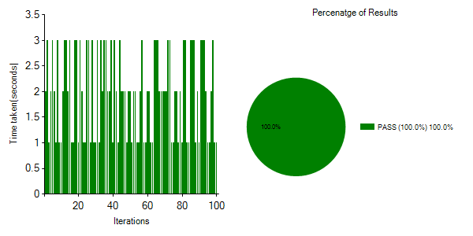

# LogInfo Library

The LogInfo library provides an efficient way to monitor performance and visualize the distribution of test results during repetitive loops. By leveraging functions like StartTimeCheck, StartTime, EndTime, and DrawCharts, users can track performance times and generate graphical representations of loop outcomes. The charts generated include Pie Charts (to show result distribution) and Column Charts (to display performance time).

## Basic Time Measure
Following sample script just provides usages of LogInfo library.

```javascript

using LogInfo

LogInfo_Example
{ 
    LogInfo.StartTimeCheck(Login)  // Initiates tracking for Login phase
    
    Repeat:100  // Running the test for 100 repetitions
    {
        LogInfo.StartTime(Login, ${R})  // Marks the start time for Login phase
        Random Sleep(1, 3)  // Simulates the login process with a random sleep between 1 and 3 seconds
        LogInfo.EndTime(Login, ${R})  // Marks the end time for Login phase
    }
    
    LogInfo.DrawCharts(Login)  // Draws the charts for the Login phase
}


```
After execution, the time measure data will be saved in a CSV file located in your output folder. The file will contain detailed information about each loop's start time, end time, elapsed time, and result. Additionally, a trend graph will be generated in the report and also you can see trend graph in the report as below:





# Script Overview

## 1. StartTimeCheck

The StartTimeCheck function initiates the performance tracking session for a specific test phase. It prepares the system to monitor different actions (e.g., login, print, etc.) throughout the loop.


```javascript

LogInfo.StartTimeCheck(Login)


```
**Purpose:** Starts tracking the Login phase's execution time.
**Parameter:** The name of the phase, such as "Login", which will be monitored during the loop.

## 2. StartTime and EndTime

**StartTime:** Marks the beginning of a specific action, like a login attempt, within each loop iteration. 
**EndTime:** Records the end time of the action and calculates the time taken to complete the task.


```javascript

LogInfo.StartTime(Login, ${R})  // Marks the start of the Login phase
Random Sleep(1, 3)  // Simulates a random delay between 1 and 3 seconds
LogInfo.EndTime(Login, ${R})  // Marks the end of the Login phase


```
**StartTime:** Logs the start time for the Login phase in each loop repetition.
**EndTime:** Logs the end time and calculates the total time for that loop.

## 3. DrawCharts

The DrawCharts function generates visual representations of the test results:

```javascript

LogInfo.DrawCharts(Login)

```
## Chart Generation Details
**Pie Chart:** Displays the distribution of PASS, FAIL, and ERROR results across all loop iterations as percentages.

**Column Chart:** Displays the time taken for each loop iteration.


