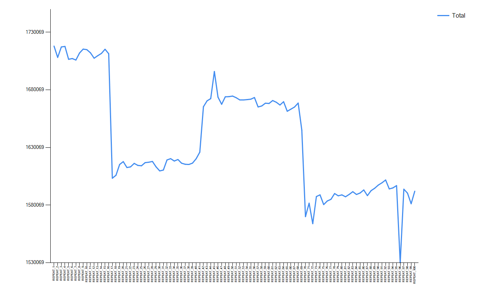
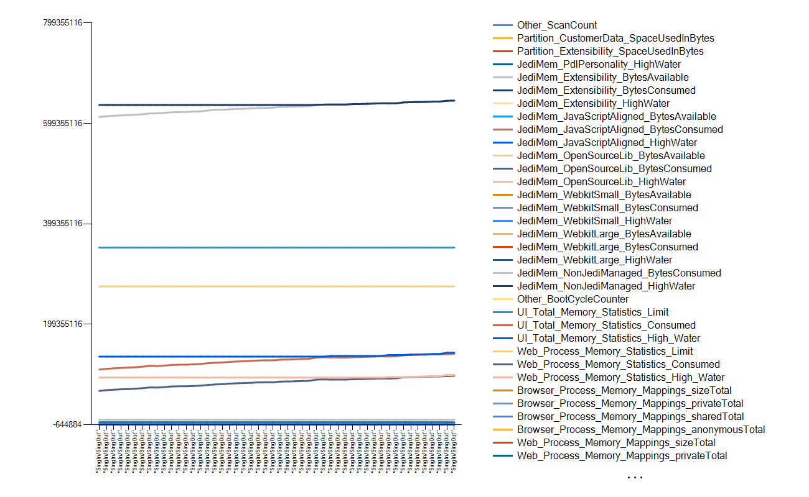
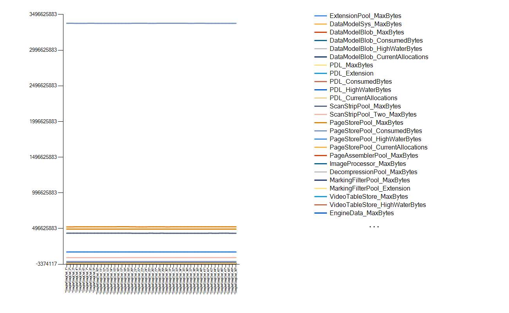
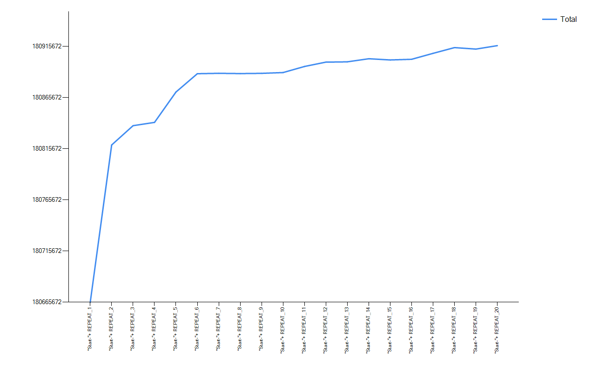

# Memory monitoring sample scripts

## Script for Android Devices

 Android memory monitoring collects size of memory by process.

```javascript
using Android

Memory Monitoring Example
{
    // Define Memory Monitoring task
    Android.Start Memory Monitoring
    
    // Repeat test scenario and dump memory usage
    Repeat:100
    {
        // Simple scenario : Open contacts app and click navigation drawer button and exit app.
        Android.Launch (com.android.contacts)
        Android.Touch XPath (//node[@content-desc='Open navigation drawer'])
        Android.Press Back Key
        Android.Press Back Key
        Android.Press Home Key
        
        // Collect Memory data after each repetition
        Android.Collect Memory Info (REPEAT_${R})
    }
    
    // See the memory usage trend with the help of Graph.
    Android.Draw Memory Usage Graph
    
}
```
See the memory usage trend over repetitions (check if memory usage is increased over time)
To check more details of memory usage, see the csv file in output folder. (Path of csv file is also placed in report in keyword of Start Memory Monitoring)



Find the report in csv format [here](.resources/AndroidMemoryMonitoring_220420_12061501.csv)


## Script for JediOmni Devices

JediOmni library collects memory information of
- JediMem_Extensibility <br>
- JediMem_NonJediManaged <br>
- JediMem_OpenSourceLib <br>
- JediMem_WebkitSmall <br>
- JediMem_WebkitLarge <br>
- JediMem_JavaScriptAligned<br>
- JediMem_PdlPersonality<br>
- ToolHelpAPI <br>
- Partition_Extensibility <br>
- Partition_CustomerData <br>
- GlobalMemoryStatus <br>
- UI_Total_Memory_Statistics <br>
- Web_Process_Memory_Statistics <br>
- Network_Process_Memory_Mappings <br>
- Web_Process_Memory_Mappings <br>
- Browser_Process_Memory_Mappings <br>

```javascript
// This test case captures JediOmni Devices Memory collectors

Using JediOmni
TestSingInSingOutLoop
{ 
    // Define memory monitoring Task and this creates a CSV file in output folder.
    JediOmni.Start Memory Monitoring
    
    // Repeat the Sing In and Sing Out steps with the device for atleast 100 repetitions to detect memory leak in devices under test.
    Repeat:50
    {    
      // Using GFriend UI Inspector captured below controls and doing sing in and singout scenario
      JediOmni.Wait For Object (hpid-control-signin,10)
      JediOmni.Touch ID (hpid-control-signin)
      
      JediOmni.Wait For Object (hpid-dropdown-agent,5)
      JediOmni.Touch ID (hpid-dropdown-agent)

      JediOmni.Wait For Object (hpid-dropdown-agent-hp_EmbeddedWindows_v1,5)
      JediOmni.Touch ID (hpid-dropdown-agent-hp_EmbeddedWindows_v1)

      // Sleep for 5 seconds for the device to load the next screen
      Sleep (5)

      JediOmni.Wait For Object (hpid-signin-textbox-UserNameTextBox,10)
      JediOmni.Touch ID (hpid-signin-textbox-UserNameTextBox)
      // Type administrator userid
      JediOmni.Input Text(Administrator)
      JediOmni.Wait For Object (hpid-keyboard-key-done,5)
      JediOmni.Touch ID (hpid-keyboard-key-done)

      // Sleep for 5 seconds for the device to load the next screen
      Sleep (5)

      JediOmni.Wait For Object (hpid-signin-textbox-PasswordTextBox,10)
      JediOmni.Touch ID (hpid-signin-textbox-PasswordTextBox)
      // Type password for the administrator
      JediOmni.InputText (rdl@12345)

      JediOmni.Wait For Object (hpid-keyboard-key-done,5)
      JediOmni.Touch ID (hpid-keyboard-key-done)

      JediOmni.Wait For Object (hpid-button-signin-ok,5)
      JediOmni.Touch ID (hpid-button-signin-ok)

      JediOmni.Wait For Object (hp-button-signin-or-signout,5)
      JediOmni.Touch ID (hp-button-signin-or-signout)

      // This method collects the memory info with the lable SignIn and Signout
      // This method saves the data in CSV format
      JediOmni.Collect Memory Info ("SingIn/SingOut")
    }    
    
    //This method draws the graph using the memory data collected.
    JediOmni.Draw Memory Usage Graph 
}
```
Memory usage graph



Find the report in csv format [here](.resources/JediOmniMemoryMonitoring_220421_14392549.csv)

## Script for Dune Devices

Dune library collects memory information of
- ExtensionPool <br>
- DataModelSys <br>
- DataModelBlob <br>
- PDL <br>
- ScanStripPool <br>
- ScanStripPool_Two <br>
- PageStorePool <br>
- PageAssemblerPool <br>
- ImageProcessor <br>
- DecompressionPool <br>
- MarkingFilterPool <br>
- VideoTableStore <br>
- EngineData <br>
- ImagePersisterPool <br>
- ImagePipePool <br>
- TableManagerPool <br>
- FinalToc <br>
- FormatterToJpegHardwarePool <br>
- VideoControllerTables <br>
- SystemStats <br>
- SystemMemInfo	<br>

```javascript
// This test case captures Dune Devices Memory collectors

Using Dune
TestSingInSingOutLoop
{ 
    // Define memory monitoring Task and this creates a CSV file in output folder.
    Dune.Start Memory Monitoring
    
     // Repeat the Sign In and Sign Out steps with the device for atleast 100 repetitions to detect memory leak in devices under test.
    Repeat:50
    {    
      // Using GFriend UI Inspector captured below controls and doing sign in and signout scenario
      Dune.Wait For (#StatusButtonSignIn,10)
      Dune.Click (#StatusButtonSignIn)
      Sleep (1)
      Dune.Wait For (#windowsSignInComboBox,5)
      Dune.Set Text (#windowsUsernameInputField,rdladmin)
      Sleep (1)
      Dune.Set Text (#windowsPasswordInputField,rdl@123)
      Sleep (1)
      Dune.Click (#windowsSignInButton)
      
      //wait for toastmessage to disappear
      If: Dune.Wait For (#infoTextToastMessage,10)
      {     
          Sleep (3)
      }     
      Fail:
      {     
          Return With Fail (unable to login)
          Stop Test Case
      }     
      
      If: Dune.Wait For (#StatusButtonSignOut,10)
      {     
          // clicking on sign out button
          Dune.Click Id (#StatusButtonSignOut)
          Sleep (4)
      }     
      Fail:
      {     
          Dune.Go To Home Screen
      }     
      // This method saves the data in CSV format
      Dune.Collect Memory Info ("SingIn/SingOut")
    }    
    
    //This method draws the graph using the memory data collected.
    Dune.Draw Memory Usage Graph  
}
```
Memory usage graph



Find the report in csv format [here](.resources/DuneMemoryMonitoring_241128_15330091.csv)

## Script for Windows Devices
   
```javascript
Using Windows

Test Windows Memory Monitors
{
    // Starts memory Monitoring task
    Windows.Start Memory Monitoring
    // Repeat test scenario and dump memory usage
    Repeat:20
    {
        // Memory Collection with repeat count
        Windows.Collect Memory Info ("Start-"+ REPEAT_${R})
    }
    // Draw graph for all the repetitions
    Windows.Draw Memory Usage Graph 
}
```
## Memory collection for local machine

```javascript

Using Windows At localhost
Test Windows Memory Monitors 
{
    Remote Run:localhost
    {
        // Keywords to run in remote executor.
        Windows.Start Memory Monitoring
        Windows.Collect Memory Info ("Start")
        Windows.Draw Memory Usage Graph 
     }
}
```
## Memory collection for remote machine
Memory collection with remote executor. 
By using remote executor in solution server, you can collect solution server's memory usage while testing.

```javascript

Using Windows At <SolutionServer>
Test Windows Memory Monitors 
{
    Remote Run:<SolutionServer>
    {
        // Keywords to run in remote executor.
        Windows.Start Memory Monitoring
        Windows.Collect Memory Info ("Start")
        Windows.Draw Memory Usage Graph 
        // JediOmni.Capture Screen Shot ("Radiobutton")
     }
}
```
Memory usage graph



Find the report in csv format [here](.resources/WindowsMemoryMonitoring_220426_15562521.csv)

## Script to collect memory collectors on application servers

```javascript
// running memory collectors at remote machine HPAdvanced
using Windows At HPAdvanced
using JediOmni
using Oxpd

test
{
   // run the test case on remote machine 
   // start monitoring on the remote machine
    Remote Run:HPAdvanced
    {
        Windows.Start Memory Monitoring
    }
    
    // repeate the steps for 100 repetitions
    Repeat:100
    {
        // Run some solution tests
        JediOmni.Touch Text(HP Advanced)
        Oxpd.Get Browser Engine
        
        // Run script on remote machine
        Remote Run:HPAdvanced
        {
            // collect memory info
            Windows.Collect Memory Info(${R})
        }
        // wait for completing the collection on HPAdvanced 
        Wait For Remote Complete (HPAdvanced)
    }
    
    // run on Remote machine
    Remote Run:HPAdvanced
    {
        // Draw memory usage graph
        Windows.Draw Memory Usage Graph
    }
    // wait for completion of 
    Wait For Remote Complete (HPAdvanced)
}
