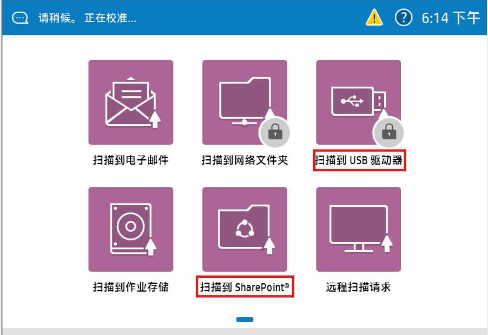
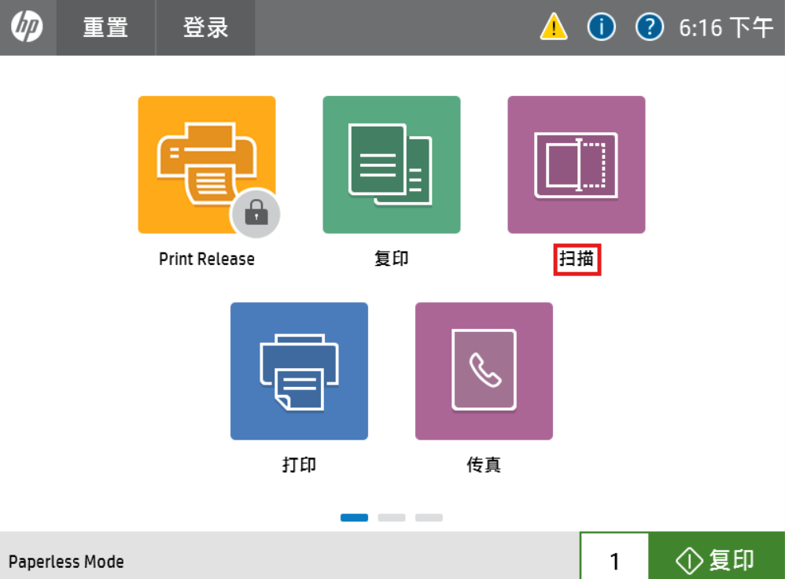
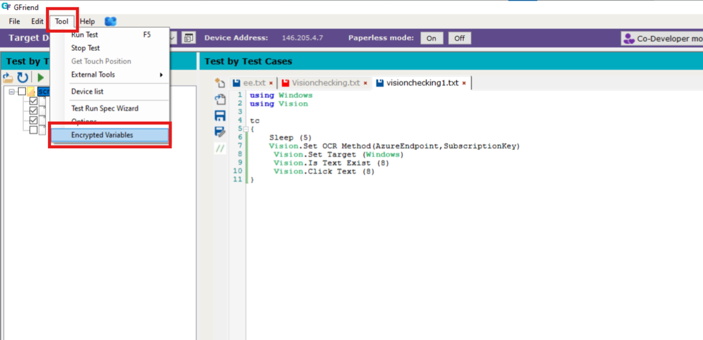
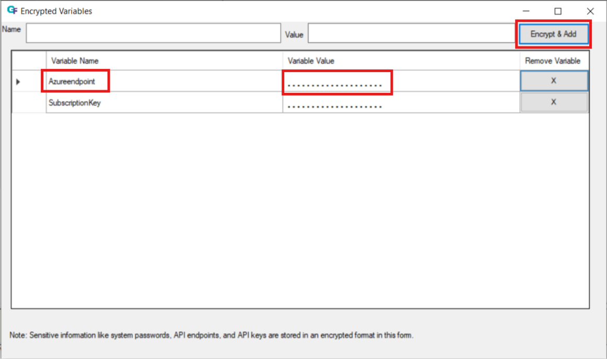

# Vision
 
 If Automation tester is unable to retrieve the object Ids or using xpath of a specific object on the screen (printer console) then we use Vision library. 
 Vision uses internally tessaract library and Azure Vision AI for identifying the text on the screens.

# How Vision library works

By default it uses tessaract library and if we mention SetOCRMethod(AzureEndpoint,secretkey) then it uses Azure Vision AI services OCR to find the text.
It checks english as well as  Chinese text. Azure Vision supports only chinese text alone or combination of chinese and english text. Eg., given in the sample image below





Azure Vision Endpoint needs to be provided by the tester based on his subscription with Azure, as GFriend wont support any default subscription for Vision.

# Existing testract vision usage

The existing Tesseract Vision works as follows: 
1. First, we set the target device (e.g., Windows, Android, Dune). 
2. After that, we configure the text grouping to define whether the text is a word or a block of words. 
3. Once the grouping is set, we can call other keywords, such as checking if text exists or performing click actions.


```javascript
using Vision
test
{   
   // Set the target platform for Vision. This could be Android, Windows, iOS, Mac, or Dune.
Vision.SetTarget(Windows)

// Set the text grouping to whether its word or block
Vision.SetTextGrouping(Word)

//Check if the specified text exists on the screen
Vision.IsTextExist(On)

// clicking on the particulat text
Vision.Click Text (On)
}
```

# Azure Vision usage from GFriendUI

Now that Azure Vision OCR has been integrated to extract the text in the image more accurately, the process remains similar to the existing Tesseract Vision setup. You will first call the SetOcrMethod function with your Azure credentials (i.e., the Azure Endpoint and subscription key). After that, the flow continues in the same way as the previous Tesseract Vision method, allowing you to extract text from the screen and interact with it.

```javascript
using Vision
test
{ 
    //Set the Ocr method as azure
  Vision.SetOcrMethod(azureEndPointAPI, subscriptionSecretKey)
  // Set the target platform for Vision. This could be Android, Windows, iOS, Mac, or Dune.
  Vision.SetTarget(Windows)
  // Set the text grouping to whether its word or block
  Vision.SetTextGrouping(Word)
  //Check if the specified text exists on the screen
  Vision.IsTextExist(On)
  // clicking on the particulat text
  Vision.Click Text (On)
}
```

# Azure Vision usage from STB/CommandPrompt
If the user intends to use Vision from the Command Prompt or while running from STB, the Azure endpoint and subscription key must first be encrypted. The encrypted values should then be provided to the "Set OCR Method".Please refer to the example below for a better understanding of how to use Vision - Azure from STB or the Command Prompt.

AzureVision.txt
```javascript
using Vision
using Windows
using AzureVariables.gfvar
test
{ 
    Windows.Select Application (Taskbar) 
    Windows.Click Name (Search)     
    Windows.Set Text With Name (Search,hp smart)
    Sleep (2) 
    Windows.Send Special Key ([ENTER]) 
    Windows.Select Application (HP Smart)
    Sleep (3) 
    Windows.Maximize Window  
    Sleep (3)
    //${AzureEndpoint} is a variable from AzureVariables.gfvar file which has actual value of the Azure Endpoint , ${AzureEndpointEncryptedValue} stores the encrypted value of Azure Endpoint
    Encrypt(${AzureEndpoint},${AzureEndpointEncryptedValue})
    //${SubscriptionKey} is a variable from AzureVariables.gfvar file which has actual value of the Subscription Key , ${SubscriptionKeyEncryptedValue} stores the encrypted value of Subscription Key
    Encrypt(${SubscriptionKey},${SubscriptionKeyEncryptedValue})
    //Pass the encrypted values of Azure Endpoint and Subscription key in the Set OCR Method Keyword
    //1.If the endpoint and subscriptionkey are encrypted in the Encrypted Variables form , then pass the 3rd parameter as "UI" 
    //2.If the endpoint and subscriptionkey are encrypted using Encrypt Keyword , then pass the 3rd parameter as "ENCRYPT"
    Vision.Set OCR Method(${AzureEndpointEncryptedValue},${SubscriptionKeyEncryptedValue},ENCRYPT)
    Vision.Set Target (WINDOWS)
    Vision.Set Text Grouping (word)
    Vision.Is Text Exist (My HP Cloud Scans)
    Vision.Click Text (My HP Cloud Scans)
    Sleep(2)
}
```
AzureVariables.gfvar
```javascript
${AzureEndpoint}=https://cvgf001.cognitiveservices.azure.com/ //please pass Azure Endpoint value
${SubscriptionKey}=sjfhkjehwjfj //please pass subscription key value
```

# Encryption and Decryption of Azure Parameters:
For enhanced security, we no longer pass the Azure Endpoint and Subscription Key directly as method parameters. Instead, these values are securely encrypted and stored. The names of the encrypted variables (e.g., AzureEndpoint, SubscriptionKey) are passed as parameters to the Vision.SetOCR method. The system automatically decrypts these values internally when making the API call

### Below are the steps to follow for adding azure endpoint and subscrption key in the encrpted variable form:

Navigate to Tools and select Encrypted Variables. This will open a new window Encrypted Variables as shown in below.





In the Name field, enter the variable name you wish to use.
In the Value field, enter the actual values for the Azure endpoint and subscription key.
Click the Encrypt and Add button. This will encrypt the values and store them securely.


After encryption, the variable names for the Azure endpoint and subscription key can be used in the Vision.SetOCRMethod keyword parameters.


### Important points to remember

1. The screen resolution on Windows must be set to 100% during vision operations.
2. End users are required to renew their Azure subscription key on a monthly basis.
3. End users must use their own Azure Vision endpoint and subscription key for testing purposes